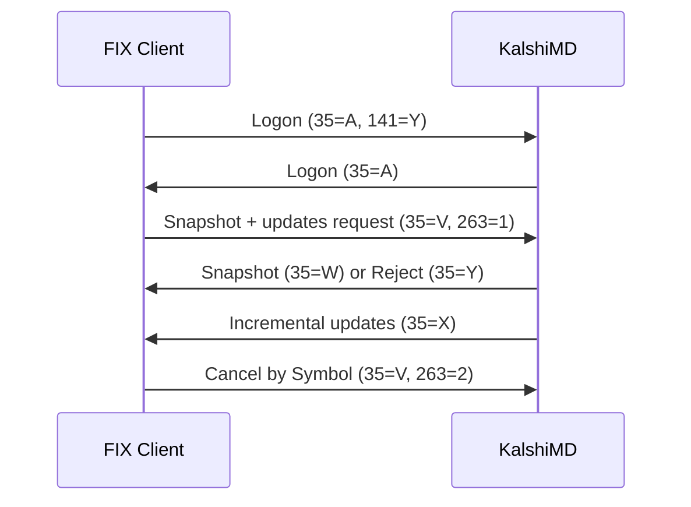

> ## Documentation Index
> Fetch the complete documentation index at: https://docs.kalshi.com/llms.txt
> Use this file to discover all available pages before exploring further.

# Market Data

> Request order book snapshots and incremental updates through FIX

Market data is available on the dedicated **KalshiMD** session. It supports order book snapshots, incremental updates, and per-market trading-status changes via [Security Status](#security-status). Subscriptions are identified by `Symbol<55>`.

`KalshiMD` does not support message retransmission. Use `ResetSeqNumFlag<141>=Y` on Logon.

## Message Flow



## Market Data Request (35=V)

| Tag | Name                    | Type    | Required | Description                                                                                                                                                                                               |
| --- | ----------------------- | ------- | -------- | --------------------------------------------------------------------------------------------------------------------------------------------------------------------------------------------------------- |
| 263 | SubscriptionRequestType | Char    | Y        | `0`=Snapshot, `1`=Snapshot plus updates, `2`=Disable previous snapshot plus update request                                                                                                                |
| 146 | NoRelatedSym            | Integer | C        | Number of `55=Symbol` entries in the repeating group that follows. Required for `263=0` and `263=1`. For `263=2`, the listed symbols are unsubscribed; omit to cancel all of the session's subscriptions. |
| 55  | Symbol                  | String  | C        | Repeating group field. The market tickers to subscribe to or cancel.                                                                                                                                      |

```fix Example snapshot request theme={null}
8=FIXT.1.1|35=V|49=your-api-key|56=KalshiMD|263=0|146=1|55=KXNBAGAME-26MAY25NYKCLE-NYK|
```

```fix Example snapshot-plus-updates subscription theme={null}
8=FIXT.1.1|35=V|49=your-api-key|56=KalshiMD|263=1|146=1|55=KXNBAGAME-26MAY25NYKCLE-NYK|
```

```fix Example cancel a symbol theme={null}
8=FIXT.1.1|35=V|49=your-api-key|56=KalshiMD|263=2|146=1|55=KXNBAGAME-26MAY25NYKCLE-NYK|
```

```fix Example cancel all subscriptions theme={null}
8=FIXT.1.1|35=V|49=your-api-key|56=KalshiMD|263=2|
```

## Market Data Snapshot Full Refresh (35=W)

Sent in response to a snapshot request and immediately after a snapshot-plus-updates subscription is accepted. Correlate by `Symbol<55>`.

| Tag | Name        | Type     | Required | Description                               |
| --- | ----------- | -------- | -------- | ----------------------------------------- |
| 55  | Symbol      | String   | Y        | Market ticker.                            |
| 268 | NoMDEntries | Integer  | Y        | Number of book levels.                    |
| 269 | MDEntryType | Char     | Y        | Repeating group field. `0`=Bid, `1`=Offer |
| 270 | MDEntryPx   | Price    | Y        | Book level price in dollars.              |
| 271 | MDEntrySize | Quantity | Y        | Book level size in contracts.             |

```fix Example snapshot response theme={null}
8=FIXT.1.1|35=W|49=KalshiMD|56=your-api-key|55=KXNBAGAME-26MAY25NYKCLE-NYK|268=2|269=0|270=0.3500|271=10.00|269=1|270=0.6500|271=5.00|
```

## Market Data Incremental Refresh (35=X)

Sent after a subscribed market's aggregated book levels change or a trade occurs. Correlate by `Symbol<55>` on each entry.

| Tag | Name           | Type     | Required | Description                                             |
| --- | -------------- | -------- | -------- | ------------------------------------------------------- |
| 268 | NoMDEntries    | Integer  | Y        | Number of market data entries.                          |
| 279 | MDUpdateAction | Char     | Y        | Repeating group field. `0`=New, `1`=Change, `2`=Delete. |
| 55  | Symbol         | String   | Y        | Repeating group field. Market ticker.                   |
| 269 | MDEntryType    | Char     | Y        | Repeating group field. `0`=Bid, `1`=Offer, `2`=Trade    |
| 270 | MDEntryPx      | Price    | Y        | Price in dollars.                                       |
| 271 | MDEntrySize    | Quantity | Y        | Size in contracts.                                      |

```fix Example incremental update theme={null}
8=FIXT.1.1|35=X|49=KalshiMD|56=your-api-key|268=1|279=1|55=KXNBAGAME-26MAY25NYKCLE-NYK|269=0|270=0.3500|271=15.00|
```

```fix Example trade update theme={null}
8=FIXT.1.1|35=X|49=KalshiMD|56=your-api-key|268=1|279=0|55=KXNBAGAME-26MAY25NYKCLE-NYK|269=2|270=0.6500|271=3.00|
```

## Market Data Request Reject (35=Y)

Sent when a market data request cannot be accepted. Unknown market tickers are not currently rejected; the server sends an empty snapshot if it has no order book for the requested symbol.

| Tag | Name           | Type   | Required | Description                      |
| --- | -------------- | ------ | -------- | -------------------------------- |
| 281 | MDReqRejReason | Char   | N        | Reject reason.                   |
| 58  | Text           | String | N        | Human-readable rejection detail. |

### Common Reject Reasons (281)

* `2`=Insufficient bandwidth, including request or session symbol limits
* `4`=Unsupported `SubscriptionRequestType`

## Security Status

`KalshiMD` also streams per-market trading-status changes as `SecurityStatus<35=f>`. Subscribe by `Symbol<55>` with `SecurityStatusRequest<35=e>`. Updates are changes-only; no initial status is sent on subscribe.

### Security Status Request (35=e)

| Tag | Name                    | Type   | Required | Description                                              |
| --- | ----------------------- | ------ | -------- | -------------------------------------------------------- |
| 263 | SubscriptionRequestType | Char   | Y        | `1`=Subscribe, `2`=Unsubscribe.                          |
| 55  | Symbol                  | String | Y        | The single market ticker to subscribe to or unsubscribe. |

```fix Example subscribe theme={null}
8=FIXT.1.1|35=e|49=your-api-key|56=KalshiMD|263=1|55=KXNBAGAME-26MAY25NYKCLE-NYK|
```

```fix Example unsubscribe theme={null}
8=FIXT.1.1|35=e|49=your-api-key|56=KalshiMD|263=2|55=KXNBAGAME-26MAY25NYKCLE-NYK|
```

### Security Status (35=f)

Streamed when a subscribed market changes trading state. Correlate by `Symbol<55>`.

| Tag | Name                  | Type   | Required | Description                                                    |
| --- | --------------------- | ------ | -------- | -------------------------------------------------------------- |
| 55  | Symbol                | String | Y        | Market ticker.                                                 |
| 326 | SecurityTradingStatus | Int    | Y        | See [Trading Status Lifecycle](#trading-status-lifecycle-326). |

```fix Example trading halt theme={null}
8=FIXT.1.1|35=f|49=KalshiMD|56=your-api-key|55=KXNBAGAME-26MAY25NYKCLE-NYK|326=2|
```

### Trading Status Lifecycle (326)

* `3`=Resume: the market was activated and is open for trading
* `2`=Trading halt: the market was deactivated
* `100`=Kalshi determined: the market was determined; trading has ended and the result is known
* `101`=Kalshi settled: the market settled. The subscription for that symbol is then dropped.

Scheduled (time-based) opens and closes are not emitted as discrete events and are not reported here.
