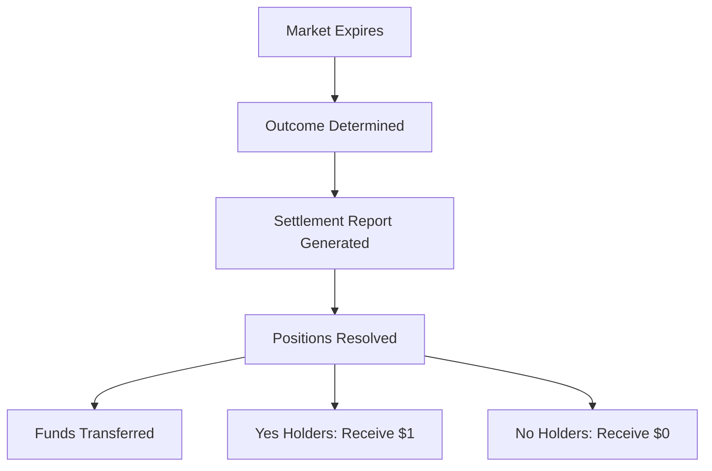

<!--
Source: https://docs.kalshi.com/fix/market-settlement.md
Downloaded: 2026-02-22T23:06:59.949Z
-->

> ## Documentation Index
> Fetch the complete documentation index at: https://docs.kalshi.com/llms.txt
> Use this file to discover all available pages before exploring further.

# Market Settlement

> Settlement reports for market outcomes and position resolution

# Market Settlement

## Overview

Market settlement messages provide information about market outcomes and the resulting position settlements. These messages are available on:

* **KalshiPT** (Post Trade) sessions
* **KalshiRT** sessions when `ReceiveSettlementReports=Y` in Logon

<Info>
  Settlement occurs when a market's outcome is determined, triggering automatic position resolution and fund transfers.
</Info>

## Market Settlement Report (35=UMS)

Provides settlement details for a specific market.

### Message Structure

| Tag   | Name                          | Description                                    | Required |
| ----- | ----------------------------- | ---------------------------------------------- | -------- |
| 20105 | MarketSettlementReportID      | Unique settlement identifier                   | Yes      |
| 55    | Symbol                        | Market ticker (e.g., NHIGH-23JAN02-66)         | Yes      |
| 715   | ClearingBusinessDate          | Date settlement cleared (YYYYMMDD)             | Yes      |
| 20106 | TotNumMarketSettlementReports | Total number of settlement reports in sequence | No       |
| 20107 | MarketResult                  | Result of the market when determined           | Yes      |
| 893   | LastFragment                  | Last page indicator (Y/N)                      | No       |
| 730   | SettlementPrice               | Settlement price of market                     | Yes      |

### Repeating Groups

#### Party Information (NoMarketSettlementPartyIDs)

| Tag   | Name                       | Description                           |
| ----- | -------------------------- | ------------------------------------- |
| 20108 | NoMarketSettlementPartyIDs | Number of parties                     |
| 20109 | MarketSettlementPartyID    | Unique identifier for party           |
| 20110 | MarketSettlementPartyRole  | Type of party (Customer Account\<24>) |
| 704   | LongQty                    | Number of YES contracts held          |
| 705   | ShortQty                   | Number of NO contracts held           |

#### Collateral Changes (NoCollateralAmountChanges)

| Tag  | Name                      | Description                                                             |
| ---- | ------------------------- | ----------------------------------------------------------------------- |
| 1703 | NoCollateralAmountChanges | Number of collateral changes (should be only 1 - payout balance change) |
| 1704 | CollateralAmountChange    | Delta in dollars                                                        |
| 1705 | CollateralAmountType      | Balance\<1> or Payout\<2>                                               |

#### Fees (NoMiscFees)

| Tag | Name         | Description                                                     |
| --- | ------------ | --------------------------------------------------------------- |
| 136 | NoMiscFees   | Number of fees (currently zero, single item with zeroed values) |
| 137 | MiscFeeAmt   | Total fees for settlement in dollars                            |
| 138 | MiscFeeCurr  | Currency (USD)                                                  |
| 139 | MiscFeeType  | Type of fee (Exchange fees\<4>)                                 |
| 891 | MiscFeeBasis | Unit for fee (Absolute\<0>)                                     |

## Settlement Process

### Market Resolution Flow



### Settlement Calculations

For each position:

* **Yes outcome**: Yes contract holders receive \$1 per contract
* **No outcome**: No contract holders receive \$1 per contract
* **Net position**: Only net positions are settled (after netting)

## Example Settlement Report

```fix  theme={null}
// Market settled as "Yes"
8=FIXT.1.1|35=UMS|
20105=settle-123|55=HIGHNY-23DEC31|715=20231231|
20107=Yes|
20108=1|
  20109=user-456|20110=24|
  704=100|705=0|
  1703=1|
    1704=10000|1705=1|
  136=1|
    137=0.00|138=USD|139=4|891=0|
893=Y|
```

This example shows:

* Market HIGHNY-23DEC31 settled as "Yes"
* User held 100 Yes contracts
* Received \$100.00 (10000 cents) to balance
* No settlement fees

## Pagination

Large settlement batches may span multiple messages:

| Tag   | Use Case                                  |
| ----- | ----------------------------------------- |
| 20106 | Total number of reports in batch          |
| 893   | LastFragment=N for more pages, Y for last |

<Warning>
  **Important:** The `MarketSettlementReportID` (tag 20105) will be different across paginated responses.
  Each page of results generates a new unique settlement ID. Use the `Symbol` (tag 55) ticker to identify fragments belonging to the same paginated settlement.
</Warning>

## Settlement Timing

<Warning>
  Markets typically settle shortly after expiration, but timing can vary based on:

  * Market type
  * Data source availability
  * Manual review requirements
</Warning>

## Integration Considerations

### 1. Position Reconciliation

```python  theme={null}
def reconcile_settlement(report):
    # Verify position matches records
    our_position = get_position(report.Symbol)

    if report.LongQty != our_position.yes_contracts:
        alert("Position mismatch", report)

    # Verify payout calculation
    if report.MarketResult == "Yes":
        expected_payout = report.LongQty * 100  # cents
    else:
        expected_payout = report.ShortQty * 100

    if report.CollateralAmountChange != expected_payout:
        alert("Payout mismatch", report)
```

### 2. Multi-Account Handling

For sessions managing multiple accounts:

* Each party (sub-account) receives separate entry
* Aggregate by MarketSettlementPartyID
* Track settlements per account

### 3. Fee Processing

Currently settlement fees are zero, but implement handling for future changes:

* Parse NoMiscFees group
* Account for fees in P\&L calculations
* Track fee types for reporting

## Best Practices

### Real-time Processing

<Steps>
  <Step title="Subscribe to Reports">
    Set ReceiveSettlementReports=Y in KalshiRT Logon
  </Step>

  <Step title="Process Immediately">
    Update positions and balances in real-time
  </Step>

  <Step title="Reconcile">
    Compare with expected outcomes and positions
  </Step>

  <Step title="Update Risk">
    Adjust risk calculations for settled positions
  </Step>
</Steps>

### Batch Processing

For post-trade reconciliation:

1. Connect to KalshiPT session
2. Query for day's settlements
3. Process in sequence order
4. Generate settlement reports

## Related Systems

| System      | Purpose                               |
| ----------- | ------------------------------------- |
| Order Entry | Track positions leading to settlement |
| Drop Copy   | Audit trail of trades                 |
| Market Data | Market expiration times               |
| REST API    | Query market details and outcomes     |

## Error Scenarios

### Missing Settlements

If settlements are missing:

1. Check connection to appropriate session
2. Verify ReceiveSettlementReports flag
3. Use REST API as backup data source
4. Contact support if discrepancies persist

### Incorrect Positions

Position mismatches may indicate:

* Missed execution reports
* Incorrect position tracking
* Late trades near expiration

Always maintain independent position tracking for verification.
