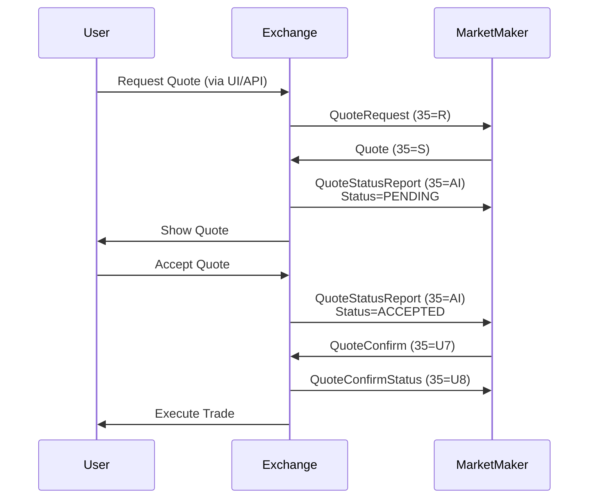

<!--
Source: https://docs.kalshi.com/fix/rfq-messages.md
Downloaded: 2026-02-22T23:06:59.949Z
-->

> ## Documentation Index
> Fetch the complete documentation index at: https://docs.kalshi.com/llms.txt
> Use this file to discover all available pages before exploring further.

# RFQ Messages

> Request for Quote functionality for market makers

# RFQ (Request for Quote) Messages

## Overview

The RFQ session allows market makers to respond to quote requests from users. The workflow involves:

1. Exchange sends QuoteRequest to market makers
2. Market makers respond with Quote
3. Requester can accept the quote
4. Market maker confirms execution

<Info>
  RFQ sessions use the KalshiRFQ endpoint with retransmission support.
</Info>

## Message Flow



## QuoteRequest (35=R)

This message is sent by Kalshi Exchange back to clients to inform of new quote requests.

| Tag   | Name                             | Type    | Required | Description                                                                                          |
| ----- | -------------------------------- | ------- | -------- | ---------------------------------------------------------------------------------------------------- |
| 131   | QuoteReqId                       | UUID    | Y        | Unique quote request ID                                                                              |
| 146   | NoRelatedSym                     | Integer | Y        | Number of symbols. Currently, only 1 is supported.                                                   |
| 38    | OrderQty                         | Integer | Y        | Number of contracts                                                                                  |
| 152   | CashOrderQty                     | Decimal | N        | Target cost of the quote in dollars.                                                                 |
| 55    | Symbol                           | String  | Y        | Market ticker                                                                                        |
| 453   | NoPartyIDs                       | Integer | N        | Number of parties. Currently, only 1 is supported.                                                   |
| 448   | PartyId                          | UUID    | N        | Pseudonymous identifier for requester                                                                |
| 20180 | MultivariateCollectionTicker     | String  | N        | Collection ticker for multivariate markets                                                           |
| 20181 | NoMultivariateSelectedLegs       | Integer | N        | Number of selected legs for multivariate markets. Repeating group containing the following 3 fields. |
| 20182 | MultivariateSelectedEventTicker  | String  | N        | Event ticker for the selected leg                                                                    |
| 20183 | MultivariateSelectedMarketTicker | String  | N        | Market ticker for the selected leg                                                                   |
| 20184 | MultivariateSelectedMarketSide   | String  | N        | Side for the selected leg ("yes" or "no")                                                            |

## Quote (35=S)

Used to submit a quote in response to a quote request. If a new Quote is created when an existing quote for the same market already exists for the user,
the exchange will cancel the existing quote.

| Tag | Name         | Type    | Required | Description                                                                                    |
| --- | ------------ | ------- | -------- | ---------------------------------------------------------------------------------------------- |
| 117 | QuoteId      | UUID    | Y        | Unique quote identifier                                                                        |
| 131 | QuoteReqId   | UUID    | Y        | Quote request for which the quote is in response to.                                           |
| 55  | Symbol       | String  | Y        | Market ticker                                                                                  |
| 132 | BidPx        | Integer | Y        | Yes price in cents. Only integer part considered (1-99)                                        |
| 133 | OfferPx      | Integer | Y        | No price in cents. Only integer part considered (1-99)                                         |
| 79  | AllocAccount | Integer | N        | Subaccount number (0-32). If provided, the quote will be created for the specified subaccount. |

<Warning>
  Either BidPx or OfferPx can be zero, but not both. Zero indicates no quote for that side.
</Warning>

## QuoteStatusReport (35=AI)

A QuoteStatusReport is sent by the exchange:

1. In response to a Quote. Status will be PENDING if processed, or REJECTED if rejected
2. When the requester accepts the quote. Status will be ACCEPTED. Quoter should reply with QuoteConfirm within 30 seconds
3. In response to a QuoteCancel. Status will be CANCELLED

| Tag | Name         | Type    | Required | Description                                                                 |
| --- | ------------ | ------- | -------- | --------------------------------------------------------------------------- |
| 117 | QuoteId      | String  | Y        | Quote identifier (empty if rejected)                                        |
| 131 | QuoteReqId   | String  | Y        | Request reference                                                           |
| 79  | AllocAccount | Integer | C        | Subaccount number (0-32). Present if the quote was created for a subaccount |
| 297 | QuoteStatus  | Integer | Y        | Current status                                                              |
| 38  | OrderQty     | Integer | C        | Number of contracts. Not present if REJECTED                                |
| 132 | BidPx        | Integer | C        | Yes price in cents. Only integer part considered. Not present if REJECTED   |
| 133 | OfferPx      | Integer | C        | No price in cents. Only integer part considered. Not present if REJECTED    |
| 54  | AcceptedSide | Char    | C        | Side accepted (1=Yes, 2=No). Only present if ACCEPTED                       |
| 58  | Text         | String  | C        | Rejection reason. Only present if REJECTED                                  |

### Quote Status Values (297)

* **ACCEPTED\<0>**: Requester accepted the quote
* **REJECTED\<5>**: Exchange rejected the quote
* **PENDING\<10>**: Quote processed, awaiting action
* **CANCELLED\<17>**: Quote cancelled

## QuoteCancel (35=Z)

Market maker cancels an active quote.

| Tag | Name    | Type   | Required | Description     |
| --- | ------- | ------ | -------- | --------------- |
| 117 | QuoteId | String | Y        | Quote to cancel |

<Note>
  Exchange responds with QuoteStatusReport (Status=CANCELLED).
</Note>

## QuoteCancelStatus (35=U9)

Response to QuoteCancel from exchange.

| Tag | Name              | Type    | Required | Description                              |
| --- | ----------------- | ------- | -------- | ---------------------------------------- |
| 117 | QuoteId           | String  | Y        | Quote identifier                         |
| 298 | QuoteCancelStatus | Integer | Y        | CANCELED(0) or REJECTED(1)               |
| 58  | RejectReason      | String  | C        | Present if QuoteCancelStatus is REJECTED |

## QuoteConfirm (35=U7)

Market maker confirms willingness to execute after quote acceptance.

| Tag | Name    | Type   | Required | Description       |
| --- | ------- | ------ | -------- | ----------------- |
| 117 | QuoteId | String | Y        | Accepted quote ID |

<Warning>
  Quote must be confirmed within 30 seconds of acceptance or it will be voided.
</Warning>

## QuoteConfirmStatus (35=U8)

Exchange response to quote confirmation.

| Tag   | Name               | Type    | Required | Description                               |
| ----- | ------------------ | ------- | -------- | ----------------------------------------- |
| 117   | QuoteId            | String  | Y        | Quote identifier                          |
| 21010 | QuoteConfirmStatus | Integer | Y        | ACCEPTED(0) or REJECTED(1)                |
| 58    | RejectReason       | String  | C        | Present if QuoteConfirmStatus is REJECTED |

## QuoteRequestReject (35=AG)

Exchange notifies that a quote request was cancelled.

| Tag | Name                     | Type    | Required | Description                         |
| --- | ------------------------ | ------- | -------- | ----------------------------------- |
| 58  | Text                     | String  | Y        | Reason the quote has been cancelled |
| 131 | QuoteReqId               | String  | Y        | Request identifier                  |
| 658 | QuoteRequestRejectReason | Integer | Y        | OTHER(99)                           |

<Info>
  Market makers do not send QuoteRequestReject when ignoring a request.
</Info>

## Best Practices

### For Market Makers

1. **Response Time**
   * Respond to quote requests promptly
   * Confirm accepted quotes within 30 seconds
   * Cancel stale quotes proactively

2. **Quote Management**
   * Track active quotes locally
   * Handle quote replacements properly
   * Monitor for acceptance notifications

3. **Risk Management**
   * Validate prices before quoting
   * Implement position limits
   * Handle partial quotes (one-sided)

### Error Handling

1. **Rejection Scenarios**
   * Invalid price range
   * Symbol not found
   * Technical issues

2. **Timeout Handling**
   * 30-second confirmation window
   * Automatic quote expiration
   * Network disconnection recovery

## Example Workflow

<CodeGroup>
  ```fix QuoteRequest from Exchange theme={null}
  8=FIXT.1.1|35=R|131=req-123|146=1|38=100|55=HIGHNY-23DEC31|453=1|448=anon-456|
  ```

  ```fix Quote Response theme={null}
  8=FIXT.1.1|35=S|117=quote-789|131=req-123|55=HIGHNY-23DEC31|132=75|133=25|
  ```

  ```fix Quote Accepted theme={null}
  8=FIXT.1.1|35=AI|117=quote-789|131=req-123|297=0|54=1|38=100|
  ```

  ```fix Quote Confirmation theme={null}
  8=FIXT.1.1|35=U7|117=quote-789|
  ```
</CodeGroup>

## Integration Notes

* RFQ session requires separate connection
* Uses KalshiRFQ endpoint
* Independent of order entry session
