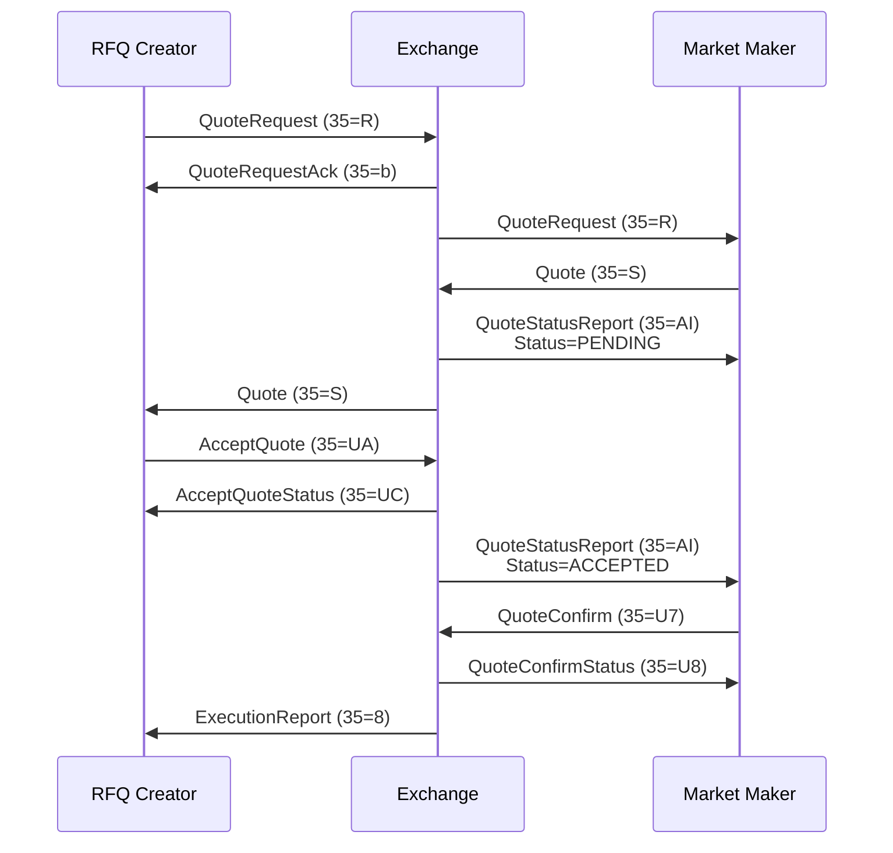

> ## Documentation Index
> Fetch the complete documentation index at: https://docs.kalshi.com/llms.txt
> Use this file to discover all available pages before exploring further.

# RFQ Messages

> Request for Quote functionality for RFQ creators and market makers

# RFQ (Request for Quote) Messages

## Overview

RFQ functionality involves two types of participants connecting via different FIX sessions:

**RFQ Creators** - Users who want to trade via RFQ (connect via **RT mode**):

1. Create RFQ via QuoteRequest (35=R)
2. Receive quotes from market makers via Quote (35=S)
3. Accept a quote via AcceptQuote (35=UA)
4. Receive trade execution via ExecutionReport (35=8)

**Market Makers** - Users who provide quotes (connect via **RfqMode**):

1. Receive QuoteRequest from exchange
2. Respond with Quote (35=S)
3. Receive acceptance notification
4. Confirm execution via QuoteConfirm (35=U7)

<Info>
  RFQ Creators use the KalshiRT endpoint (same as order entry), which provides message persistence and retransmission support. Market Makers use the KalshiRFQ endpoint to receive RFQ broadcasts and submit quotes.
</Info>

## Message Flow

### Full RFQ Flow (Creator via FIX)


```mermaid theme={null}
sequenceDiagram
    participant Creator as RFQ Creator
    participant Exchange
    participant MarketMaker as Market Maker

    Creator->>Exchange: QuoteRequest (35=R)
    Exchange->>Creator: QuoteRequestAck (35=b)
    Exchange->>MarketMaker: QuoteRequest (35=R)
    MarketMaker->>Exchange: Quote (35=S)
    Exchange->>MarketMaker: QuoteStatusReport (35=AI)<br/>Status=PENDING
    Exchange->>Creator: Quote (35=S)
    Creator->>Exchange: AcceptQuote (35=UA)
    Exchange->>Creator: AcceptQuoteStatus (35=UC)
    Exchange->>MarketMaker: QuoteStatusReport (35=AI)<br/>Status=ACCEPTED
    MarketMaker->>Exchange: QuoteConfirm (35=U7)
    Exchange->>MarketMaker: QuoteConfirmStatus (35=U8)
    Exchange->>Creator: ExecutionReport (35=8)
```

## QuoteRequest (35=R)

This message is used bidirectionally:

* **Creator → Exchange**: Create a new RFQ
* **Exchange → Market Makers**: Notify of new RFQ

### Creator → Exchange (Create RFQ)

| Tag   | Name                             | Type    | Required | Description                                                                                                                                                              |
| ----- | -------------------------------- | ------- | -------- | ------------------------------------------------------------------------------------------------------------------------------------------------------------------------ |
| 131   | QuoteReqId                       | UUID    | Y        | Client-assigned RFQ identifier                                                                                                                                           |
| 146   | NoRelatedSym                     | Integer | Y        | Number of symbols (must be 1)                                                                                                                                            |
| 55    | Symbol                           | String  | C        | Market ticker. Required unless MVE legs are specified                                                                                                                    |
| 38    | OrderQty                         | Decimal | C        | Number of contracts as a fixed-point decimal. Currently only whole contracts are accepted (for example `5`, `5.0`, or `5.00`). Required unless CashOrderQty is specified |
| 152   | CashOrderQty                     | Decimal | C        | Target cost in dollars. Required unless OrderQty is specified                                                                                                            |
| 453   | NoPartyIDs                       | Integer | N        | Number of parties (only 1 supported)                                                                                                                                     |
| 448   | PartyId                          | String  | N        | FCM SubtraderId for the customer on whose behalf the RFQ is submitted                                                                                                    |
| 452   | PartyRole                        | Integer | N        | 24 (CustomerAccount) - required when using PartyId                                                                                                                       |
| 21015 | RestRemainder                    | Char    | N        | Y/N - Allow partial fills (default: N)                                                                                                                                   |
| 21016 | ReplaceExisting                  | Char    | N        | Y/N - Whether to delete existing RFQs as part of this RFQ's creation (default: N)                                                                                        |
| 20180 | MultivariateCollectionTicker     | String  | C        | Collection ticker for parlay/MVE markets. Use instead of Symbol                                                                                                          |
| 20181 | NoMultivariateSelectedLegs       | Integer | C        | Number of MVE legs (repeating group). Required with 20180                                                                                                                |
| 20182 | MultivariateSelectedEventTicker  | String  | Y        | Event ticker for the leg                                                                                                                                                 |
| 20183 | MultivariateSelectedMarketTicker | String  | Y        | Market ticker for the leg                                                                                                                                                |
| 20184 | MultivariateSelectedMarketSide   | String  | Y        | Side for the leg ("yes" or "no")                                                                                                                                         |

<Info>
  **MVE/Parlay Support**: Instead of specifying a Symbol, you can submit MVE legs directly. The server will automatically resolve or create the parlay market and return the resolved market ticker in the QuoteRequestAck.
</Info>

### Exchange → Market Maker (RFQ Notification)

| Tag   | Name                             | Type    | Required | Description                                                                                           |
| ----- | -------------------------------- | ------- | -------- | ----------------------------------------------------------------------------------------------------- |
| 131   | QuoteReqId                       | UUID    | Y        | Server-assigned RFQ identifier                                                                        |
| 146   | NoRelatedSym                     | Integer | Y        | Number of symbols (always 1)                                                                          |
| 55    | Symbol                           | String  | Y        | Market ticker                                                                                         |
| 38    | OrderQty                         | Decimal | Y        | Number of contracts as a fixed-point decimal. Currently emitted as whole contracts                    |
| 152   | CashOrderQty                     | Decimal | N        | Target cost in dollars (if specified by creator)                                                      |
| 453   | NoPartyIDs                       | Integer | N        | Number of parties (always 1)                                                                          |
| 448   | PartyId                          | String  | N        | Requester public communications ID. This value is pseudonymous and is not the requester's SubtraderId |
| 20180 | MultivariateCollectionTicker     | String  | N        | Collection ticker for multivariate markets                                                            |
| 20181 | NoMultivariateSelectedLegs       | Integer | N        | Number of MVE legs (repeating group)                                                                  |
| 20182 | MultivariateSelectedEventTicker  | String  | N        | Event ticker for the leg                                                                              |
| 20183 | MultivariateSelectedMarketTicker | String  | N        | Market ticker for the leg                                                                             |
| 20184 | MultivariateSelectedMarketSide   | String  | N        | Side for the leg ("yes" or "no")                                                                      |

## QuoteRequestAck (35=b)

Exchange response to an inbound QuoteRequest from an RFQ creator.

| Tag   | Name             | Type    | Required | Description                                                  |
| ----- | ---------------- | ------- | -------- | ------------------------------------------------------------ |
| 131   | QuoteReqId       | UUID    | Y        | Client-assigned RFQ ID (echoed back)                         |
| 303   | QuoteRequestType | Integer | Y        | 1 (MANUAL)                                                   |
| 21023 | RfqId            | UUID    | Y        | Server-assigned RFQ ID                                       |
| 55    | Symbol           | String  | C        | Resolved market ticker. Present when MVE legs were submitted |

<Note>
  The server-assigned RFQ ID is returned in tag 21023. Store it if you want to reconcile later Quote or QuoteStatusReport messages to the created RFQ. For RFQCancel, use your original client-assigned QuoteReqId (tag 131).
</Note>

<Info>
  When creating an RFQ with MVE legs instead of a Symbol, the resolved market ticker is returned in tag 55. This is the market that was created or looked up based on your leg selection.
</Info>

## Quote (35=S)

This message is used bidirectionally:

* **Market Maker → Exchange**: Submit a quote for an RFQ
* **Exchange → Creator**: Notify creator of a new quote

If a new Quote is created when an existing quote for the same market already exists for the user, the exchange will cancel the existing quote.

### Market Maker → Exchange (Submit Quote)

| Tag | Name         | Type    | Required | Description                                                                                    |
| --- | ------------ | ------- | -------- | ---------------------------------------------------------------------------------------------- |
| 117 | QuoteId      | UUID    | Y        | Client-assigned quote identifier                                                               |
| 131 | QuoteReqId   | UUID    | Y        | Server-assigned RFQ ID (from QuoteRequest)                                                     |
| 55  | Symbol       | String  | Y        | Market ticker                                                                                  |
| 132 | BidPx        | Integer | C        | Yes price in cents (1-99)                                                                      |
| 133 | OfferPx      | Integer | C        | No price in cents (1-99)                                                                       |
| 79  | AllocAccount | Integer | N        | Subaccount number (0-32). If provided, the quote will be created for the specified subaccount. |

### Exchange → Creator (Quote Notification)

| Tag | Name       | Type    | Required | Description                                                                        |
| --- | ---------- | ------- | -------- | ---------------------------------------------------------------------------------- |
| 117 | QuoteId    | UUID    | Y        | Quote identifier (use this to accept)                                              |
| 131 | QuoteReqId | UUID    | Y        | Server-assigned RFQ ID                                                             |
| 55  | Symbol     | String  | Y        | Market ticker                                                                      |
| 132 | BidPx      | Decimal | C        | Yes price in dollars (e.g. 0.4500). Not present when zero                          |
| 133 | OfferPx    | Decimal | C        | No price in dollars (e.g. 0.5500). Not present when zero                           |
| 38  | OrderQty   | Decimal | N        | Number of contracts as a fixed-point decimal. Currently emitted as whole contracts |

<Warning>
  Either BidPx or OfferPx can be zero, but not both. Zero indicates no quote for that side.
</Warning>

## QuoteStatusReport (35=AI)

A QuoteStatusReport is sent by the exchange:

1. In response to a Quote. Status will be PENDING if processed, or REJECTED if rejected
2. When the requester accepts the quote. Status will be ACCEPTED
3. In response to a QuoteCancel. Status will be CANCELLED

| Tag | Name         | Type    | Required | Description                                                                                                   |
| --- | ------------ | ------- | -------- | ------------------------------------------------------------------------------------------------------------- |
| 117 | QuoteId      | String  | Y        | Quote identifier (empty if rejected)                                                                          |
| 131 | QuoteReqId   | String  | Y        | Request reference                                                                                             |
| 79  | AllocAccount | Integer | C        | Subaccount number (0-32). Present if the quote was created for a subaccount                                   |
| 297 | QuoteStatus  | Integer | Y        | Current status                                                                                                |
| 38  | OrderQty     | Decimal | C        | Quantity of contracts as a fixed-point decimal. Currently emitted as whole contracts. Not present if REJECTED |
| 132 | BidPx        | Integer | C        | Yes price in cents. Only integer part considered. Not present if REJECTED                                     |
| 133 | OfferPx      | Integer | C        | No price in cents. Only integer part considered. Not present if REJECTED                                      |
| 54  | AcceptedSide | Char    | C        | Side accepted (1=Yes, 2=No). Only present if ACCEPTED                                                         |
| 58  | Text         | String  | C        | Rejection reason. Only present if REJECTED                                                                    |

### Quote Status Values (297)

* **ACCEPTED\<0>**: Requester accepted the quote
* **REJECTED\<5>**: Exchange rejected the quote
* **PENDING\<10>**: Quote processed, awaiting action
* **CANCELLED\<17>**: Quote cancelled

## QuoteCancel (35=Z)

Market maker cancels an active quote.

| Tag | Name    | Type   | Required | Description     |
| --- | ------- | ------ | -------- | --------------- |
| 117 | QuoteId | String | Y        | Quote to cancel |

<Note>
  Exchange responds with QuoteStatusReport (Status=CANCELLED).
</Note>

## QuoteCancelStatus (35=U9)

Response to QuoteCancel from exchange.

| Tag | Name              | Type    | Required | Description                              |
| --- | ----------------- | ------- | -------- | ---------------------------------------- |
| 117 | QuoteId           | String  | Y        | Quote identifier                         |
| 298 | QuoteCancelStatus | Integer | Y        | CANCELED(0) or REJECTED(1)               |
| 58  | RejectReason      | String  | C        | Present if QuoteCancelStatus is REJECTED |

## QuoteConfirm (35=U7)

Market maker confirms willingness to execute after quote acceptance.

| Tag | Name    | Type   | Required | Description       |
| --- | ------- | ------ | -------- | ----------------- |
| 117 | QuoteId | String | Y        | Accepted quote ID |

<Warning>
  Quote must be confirmed within 30 seconds of acceptance or it will be voided.
</Warning>

## QuoteConfirmStatus (35=U8)

Exchange response to quote confirmation.

| Tag   | Name               | Type    | Required | Description                               |
| ----- | ------------------ | ------- | -------- | ----------------------------------------- |
| 117   | QuoteId            | String  | Y        | Quote identifier                          |
| 21010 | QuoteConfirmStatus | Integer | Y        | ACCEPTED(0) or REJECTED(1)                |
| 58    | RejectReason       | String  | C        | Present if QuoteConfirmStatus is REJECTED |

## AcceptQuote (35=UA)

RFQ creator accepts a quote from a market maker.

| Tag   | Name              | Type    | Required | Description                                                                                                                                                                                    |
| ----- | ----------------- | ------- | -------- | ---------------------------------------------------------------------------------------------------------------------------------------------------------------------------------------------- |
| 117   | QuoteId           | UUID    | Y        | Quote to accept                                                                                                                                                                                |
| 54    | Side              | Char    | Y        | FIX side (1=BUY, 2=SELL). For AcceptQuote, BUY accepts the maker's NO quote and SELL accepts the maker's YES quote.                                                                            |
| 38    | OrderQty          | Decimal | N        | Contracts to accept as a fixed-point decimal. Currently only whole contracts are accepted                                                                                                      |
| 11    | ClOrdID           | String  | N        | Client order ID                                                                                                                                                                                |
| 453   | NoPartyIDs        | Integer | N        | Number of parties (only 1 supported)                                                                                                                                                           |
| 448   | PartyId           | String  | N        | FCM SubtraderId for the customer on whose behalf the accept is submitted                                                                                                                       |
| 452   | PartyRole         | Integer | N        | 24 (CustomerAccount) for SubtraderId                                                                                                                                                           |
| 21022 | PreferBetterQuote | Char    | N        | Y/N - When set to Y, the exchange will select the best available quote for the RFQ rather than the specified quote. The best quote must be at least as good as the requested quote. Default: N |

## AcceptQuoteStatus (35=UC)

Exchange response to AcceptQuote.

| Tag   | Name              | Type    | Required | Description                                                                                                      |
| ----- | ----------------- | ------- | -------- | ---------------------------------------------------------------------------------------------------------------- |
| 117   | QuoteId           | String  | Y        | Quote identifier                                                                                                 |
| 21025 | AcceptQuoteStatus | Integer | Y        | ACCEPTED(0) or REJECTED(1)                                                                                       |
| 21024 | AcceptedQuoteId   | UUID    | Y        | The quote that was actually accepted. When PreferBetterQuote is used, this may differ from the requested QuoteId |
| 58    | Text              | String  | C        | Rejection reason if REJECTED                                                                                     |

## RFQCancel (35=UE)

RFQ creator cancels/deletes an active RFQ.

| Tag | Name       | Type | Required | Description                                         |
| --- | ---------- | ---- | -------- | --------------------------------------------------- |
| 131 | QuoteReqId | UUID | Y        | Client-assigned RFQ ID (from original QuoteRequest) |

<Note>
  Use your original client-assigned QuoteReqId from the QuoteRequest message. The RFQ ID already identifies the associated subtrader, so no PartyID fields are needed. When an RFQ is cancelled, market makers receive a QuoteRequestReject (35=AG) notification.
</Note>

## RFQCancelStatus (35=UB)

Exchange response to RFQCancel.

| Tag   | Name            | Type    | Required | Description                                                |
| ----- | --------------- | ------- | -------- | ---------------------------------------------------------- |
| 131   | QuoteReqId      | String  | Y        | RFQ identifier (echoes back the ID from RFQCancel request) |
| 21013 | RFQCancelStatus | Integer | Y        | CANCELED(0) or REJECTED(1)                                 |
| 58    | Text            | String  | C        | Rejection reason if REJECTED                               |

## QuoteRequestReject (35=AG)

Exchange notifies that a quote request was cancelled.

| Tag | Name                     | Type    | Required | Description                         |
| --- | ------------------------ | ------- | -------- | ----------------------------------- |
| 58  | Text                     | String  | Y        | Reason the quote has been cancelled |
| 131 | QuoteReqId               | String  | Y        | Request identifier                  |
| 658 | QuoteRequestRejectReason | Integer | Y        | OTHER(99)                           |

<Info>
  Market makers do not send QuoteRequestReject when ignoring a request.
</Info>

## Best Practices

### For RFQ Creators

1. **RFQ ID Management**
   * Store the server-assigned RFQ ID from QuoteRequestAck if you want to reconcile later Quote or QuoteStatusReport messages to the created RFQ
   * Use your original client-assigned QuoteReqId for RFQCancel

2. **Quote Selection**
   * Compare quotes from multiple market makers
   * Accept quotes promptly as they may expire
   * Verify price and quantity before accepting

3. **Cancellation**
   * Cancel RFQs you no longer need
   * Wait for RFQCancelStatus before considering cancelled

### For Market Makers

1. **Response Time**
   * Respond to quote requests promptly
   * Confirm accepted quotes within 30 seconds
   * Cancel stale quotes proactively

2. **Quote Management**
   * Track active quotes locally
   * Handle quote replacements properly
   * Monitor for acceptance notifications

3. **Risk Management**
   * Validate prices before quoting
   * Implement position limits
   * Handle partial quotes (one-sided)

### Error Handling

1. **Rejection Scenarios**
   * Invalid price range
   * Symbol not found
   * Insufficient balance
   * Technical issues

2. **Timeout Handling**
   * 30-second confirmation window
   * Automatic quote expiration
   * Network disconnection recovery

## Example Workflow

### RFQ Creator Flow

<CodeGroup>
  ```fix Create RFQ (Creator → Exchange) theme={null}
  8=FIXT.1.1|35=R|131=client-req-123|146=1|38=100|55=HIGHNY-23DEC31|
  ```

  ```fix Create RFQ with MVE Legs (Creator → Exchange) theme={null}
  8=FIXT.1.1|35=R|131=client-req-456|146=1|38=100|20180=PARLAY-COLLECTION|20181=2|20182=EVENT1|20183=MKT1|20184=yes|20182=EVENT2|20183=MKT2|20184=no|
  ```

  ```fix QuoteRequestAck (Exchange → Creator) theme={null}
  8=FIXT.1.1|35=b|131=client-req-123|303=1|21023=server-rfq-456|
  ```

  ```fix QuoteRequestAck with Resolved Ticker (Exchange → Creator) theme={null}
  8=FIXT.1.1|35=b|131=client-req-456|303=1|21023=server-rfq-789|55=PARLAY-MKT-ABC|
  ```

  ```fix Quote Notification (Exchange → Creator) theme={null}
  8=FIXT.1.1|35=S|117=quote-789|131=server-rfq-456|55=HIGHNY-23DEC31|132=75|133=25|38=100|
  ```

  ```fix Accept Quote (Creator → Exchange) theme={null}
  8=FIXT.1.1|35=UA|117=quote-789|54=1|38=100|
  ```

  ```fix AcceptQuoteStatus (Exchange → Creator) theme={null}
  8=FIXT.1.1|35=UC|117=quote-789|21025=0|
  ```

  ```fix Cancel RFQ (Creator → Exchange) theme={null}
  8=FIXT.1.1|35=UE|131=client-req-123|
  ```

  ```fix RFQCancelStatus (Exchange → Creator) theme={null}
  8=FIXT.1.1|35=UB|131=client-req-123|21013=0|
  ```
</CodeGroup>

### Market Maker Flow

<CodeGroup>
  ```fix QuoteRequest (Exchange → MM) theme={null}
  8=FIXT.1.1|35=R|131=server-rfq-456|146=1|38=100|55=HIGHNY-23DEC31|453=1|448=anon-456|
  ```

  ```fix Quote Response (MM → Exchange) theme={null}
  8=FIXT.1.1|35=S|117=quote-789|131=server-rfq-456|55=HIGHNY-23DEC31|132=75|133=25|
  ```

  ```fix Quote Status Pending (Exchange → MM) theme={null}
  8=FIXT.1.1|35=AI|117=quote-789|131=server-rfq-456|297=10|38=100|132=75|133=25|
  ```

  ```fix Quote Accepted (Exchange → MM) theme={null}
  8=FIXT.1.1|35=AI|117=quote-789|131=server-rfq-456|297=0|54=1|38=100|
  ```

  ```fix Quote Confirmation (MM → Exchange) theme={null}
  8=FIXT.1.1|35=U7|117=quote-789|
  ```

  ```fix QuoteConfirmStatus (Exchange → MM) theme={null}
  8=FIXT.1.1|35=U8|117=quote-789|21010=0|
  ```
</CodeGroup>

## Integration Notes

* **RFQ Creators** use the KalshiRT endpoint (RT mode) - same connection as order entry, with message persistence and retransmission support
* **Market Makers** use the KalshiRFQ endpoint (RfqMode) to receive RFQ broadcasts and submit quotes
* ExecutionReport (35=8) is sent to the RFQ creator after trade execution
* RFQs expire after 24 hours if not cancelled or accepted
