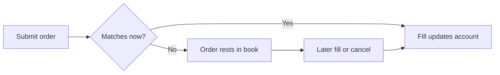

> ## Documentation Index
> Fetch the complete documentation index at: https://docs.polymarket.com/llms.txt
> Use this file to discover all available pages before exploring further.

# Concepts

> Core concepts for Polymarket perpetual markets

Perps trading depends on how order fills create or change positions, how prices
affect account equity, and how collateral supports trading risk. The concepts
below describe the moving parts that determine what an account can trade and when
a position is at risk.

## Instruments

An instrument identifies a Perps market: a tradable perpetual contract that
tracks an underlying asset such as the S\&P 500 Index, gold, or bitcoin. Each
instrument carries the information needed to identify the market and the rules
for trading it.

| Attribute           | Meaning                                                                                        |
| ------------------- | ---------------------------------------------------------------------------------------------- |
| ID                  | The instrument identifier used in market data and orders                                       |
| Symbol              | A short market label, such as `SP500-USD`, `GOLD-USD`, or `BTC-USD`                            |
| Underlying asset    | The asset or index the market tracks, such as the S\&P 500 Index, gold, or bitcoin             |
| Collateral asset    | The asset used to fund Perps accounts and support open positions. Polymarket Perps use pUSD.   |
| Trading constraints | Market-specific rules such as price precision, quantity precision, order limits, and leverage. |

## Perps Accounts

A Perps account is tied to a signer account. The signer account controls private
actions such as trading and withdrawals.

The Perps account holds the state created by those actions: collateral, open
positions, orders, fills, and history. Later sections explain how those pieces
change as orders execute, prices move, and funding payments settle.

Perps accounts are funded through onchain collateral deposits.

<Note>
  If you're building on Perps, delegated credentials let your app act for the
  Perps account without using the owner key for every private action. See
  [Authenticated Sessions](/perps/authenticated-sessions).
</Note>

## Prices

A Perps market has two broad categories of prices: execution prices and
calculated prices. Execution prices come from trades in the order book.
Calculated prices are produced by Polymarket and used for reference, margin, and
liquidation checks.

This separation matters because one small or isolated trade should not be able to
change an account's risk state or trigger liquidation by itself.

| Price        | Category         | Meaning                                                    | Used for                                            |
| ------------ | ---------------- | ---------------------------------------------------------- | --------------------------------------------------- |
| Traded price | Execution price  | The price of an executed order book fill                   | Trade history and execution records                 |
| Index price  | Calculated price | Polymarket's estimate of the underlying asset's fair value | Reference price and price anchoring                 |
| Mark price   | Calculated price | The price used to value positions                          | Unrealized PnL, margin checks, and liquidation risk |

Calculated prices are computed from external price feeds. The feed set can
change with market sessions, such as regular hours, overnight trading, and
weekends, while funding, margin, and liquidation rules stay the same around the
clock. See [Market Sessions](/perps/learn-about-trading/market-sessions).

## Orders And Fills

Orders are requests to trade in a Perps market. They can execute immediately or
rest in the order book until another order matches them.

The order book is the list of resting buy and sell orders for a market. A fill is
an executed match between orders in that book.

<Note>
  Fills update Perps account state; they are not separate onchain transactions.
</Note>



Limit orders are useful when the trade needs an explicit price. If the order does
not fill immediately, it can rest in the book where it can be inspected,
modified, or cancelled.

## Trading Positions

Once an order fills, it changes the account's position in that market. A position
is what the account currently holds: long exposure, short exposure, or no open
exposure.

| Position | Benefits when           | Loses when              |
| -------- | ----------------------- | ----------------------- |
| Long     | The tracked asset rises | The tracked asset falls |
| Short    | The tracked asset falls | The tracked asset rises |

A fill that adds to the account's current side increases exposure. A fill against
the current side reduces exposure. When the position size reaches zero, the
position is closed. If losses exceed what the account can support, the position
can also be liquidated.

## Margin And Liquidation

Perps accounts use collateral to support open positions. Margin checks compare
the account's current value against the collateral required to open, increase, or
maintain those positions.

Margin checks use these terms:

| Term               | Meaning                                                                                       |
| ------------------ | --------------------------------------------------------------------------------------------- |
| Collateral         | Funds available to support positions and withdrawals                                          |
| Account equity     | The current value of the account after open-position gains, losses, fees, and funding effects |
| Initial margin     | Collateral required to open or increase a position                                            |
| Maintenance margin | Minimum collateral required to keep a position open                                           |
| Liquidation        | Forced position closing when account equity falls below maintenance margin                    |

Account equity moves as the mark price changes and as account debits or credits
settle. It can move up or down even before a position is closed.

<Tip>
  If you're building on Perps, monitor account equity to decide when to reduce
  exposure, add collateral, or stop placing new orders.
</Tip>

At a high level, account equity is the account's collateral plus open-position
gains or losses, minus amounts owed.

```text theme={null}
Account equity = collateral + unrealized PnL - amounts owed
```

If account equity falls below maintenance margin, the account is at risk of
liquidation. Liquidation closes exposure to prevent losses from exceeding the
account's collateral.

## Funding Payments

**Funding payments** help keep a Perps market close to its index price. They are
not order-book trades; they are account debits or credits applied to open
positions over time.

<Note>
  Funding payments are different from collateral deposits. Deposits add
  collateral to a Perps account; funding payments are debits or credits between
  long and short positions.
</Note>

| Market state                    | Typical payment direction |
| ------------------------------- | ------------------------- |
| Market trades above index price | Longs pay shorts          |
| Market trades below index price | Shorts pay longs          |

A funding payment credited to the account increases account equity. A funding
payment owed by the account reduces account equity.

The **funding rate** is the rate used to calculate these payments. Public market
data shows funding rates over time, while private account history shows the
funding payments applied to an account.

## Realtime Account State

If you're building on Perps, realtime account state helps your integration keep a
local view in sync.

Integrations often keep a local view of account state so they can react quickly
to fills, risk changes, and collateral movements. Realtime updates help keep that
local view in sync.

| State change          | Why it matters                                                 |
| --------------------- | -------------------------------------------------------------- |
| Order update          | A resting order opened, changed, filled, or cancelled          |
| Fill                  | A trade executed and changed the account's position or balance |
| Portfolio update      | Account equity, margin, or position state changed              |
| Funding payment       | A funding debit or credit changed account state                |
| Deposit or withdrawal | Collateral moved into or out of the account                    |

Realtime streams can reconnect or detect gaps. When that happens, the integration
should resync by refetching the account state it depends on before trusting the
local view again.
