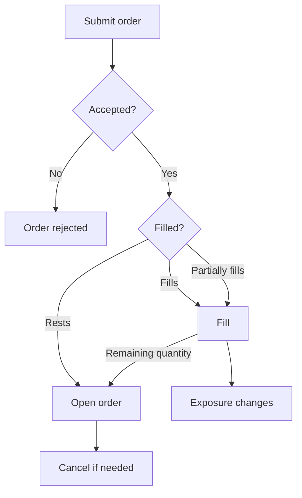

> ## Documentation Index
> Fetch the complete documentation index at: https://docs.polymarket.com/llms.txt
> Use this file to discover all available pages before exploring further.

# Trading

> Place, manage, and reconcile Perps orders

<Note>
  Trading workflows require an [authenticated
  session](/perps/authenticated-sessions).
</Note>

Perps trading changes account exposure on an instrument. An order expresses what
the account wants to do, but exposure only changes when the order fills.

An accepted order can rest on the book before it fills.



Use order state to track accepted, resting, modified, canceled, or rejected
orders. Use fills and portfolio state to confirm any exposure change.

## Start an Authenticated Session

Open an authenticated session before reading private account state or submitting
trading commands. See [Authenticated Sessions](/perps/authenticated-sessions) for
the full setup flow.

<Tabs>
  <Tab title="TypeScript">
    Create a `SecureClient`.

    ```ts theme={null}
    import { createSecureClient } from "@polymarket/client";
    import { privateKey } from "@polymarket/client/viem";

    const client = await createSecureClient({
      wallet: process.env.POLYMARKET_WALLET_ADDRESS!,
      signer: privateKey(process.env.PRIVATE_KEY!),
    });
    ```

    Open the Perps session.

    ```ts theme={null}
    const session = await client.openPerpsSession();
    ```
  </Tab>

  <Tab title="Python">
    Create an `AsyncSecureClient`.

    ```python theme={null}
    import os

    from polymarket import AsyncSecureClient

    client = await AsyncSecureClient.create(
        private_key=os.environ["PRIVATE_KEY"],
        wallet=os.environ["POLYMARKET_WALLET_ADDRESS"],
    )
    ```

    Open the Perps session.

    ```python theme={null}
    session = await client.open_perps_session()
    ```
  </Tab>

  <Tab title="API">
    Use proxy credentials for private reads and signed trading commands.

    ```http theme={null}
    polymarket-proxy: <proxy_address>
    polymarket-secret: <proxy_secret>
    ```
  </Tab>
</Tabs>

## Prepare a Trade

Start by identifying the Perps instrument you want to trade. Instruments define
the market and include the constraints used later when building an order.

<Tabs>
  <Tab title="TypeScript">
    Fetch instruments and select the market you want to trade.

    ```ts theme={null}
    const instruments = await client.fetchPerpsInstruments();
    const instrument = instruments.find((item) => item.symbol === "BTC-PERP");

    if (!instrument) {
      throw new Error("Instrument not found");
    }
    ```

    Keep the selected `instrument` available for the next steps.
  </Tab>

  <Tab title="Python">
    Fetch instruments and select the market you want to trade.

    ```python theme={null}
    instruments = await client.fetch_perps_instruments()
    instrument = next((item for item in instruments if item.symbol == "BTC-PERP"), None)

    if instrument is None:
        raise RuntimeError("Instrument not found")
    ```

    Keep the selected `instrument` available for the next steps.
  </Tab>

  <Tab title="API">
    Fetch instruments and select the market you want to trade.

    ```bash theme={null}
    curl "https://api.perpetuals.polymarket.com/v1/info/instruments"
    ```

    The response is a list of instruments.

    ```json theme={null}
    [
      {
        "instrument_id": 1,
        "instrument_type": "perpetual",
        "category": "crypto",
        "symbol": "BTC-PERP",
        "base_asset": "BTC",
        "quote_asset": "USD",
        "funding_interval": "1h",
        "quantity_decimals": 4,
        "price_decimals": 2,
        "price_bounds": "0.1",
        "liquidation_fee": "0.01",
        "max_order_count": 200,
        "min_notional": "1",
        "max_market_notional": "100000",
        "max_limit_notional": "1000000",
        "max_leverage": 10,
        "risk_tiers": [{ "lower_bound": "0", "max_leverage": 10 }]
      }
    ]
    ```

    Keep the selected instrument for the next steps.
  </Tab>
</Tabs>

## Choose Direction and Size

Before placing an order, decide whether it should open new exposure, increase
existing exposure, reduce exposure, or close the position.

The effect of a buy or sell depends on the current position.

| Current position | Buy order               | Sell order             |
| ---------------- | ----------------------- | ---------------------- |
| No position      | Opens long              | Opens short            |
| Long             | Increases long          | Reduces or closes long |
| Short            | Reduces or closes short | Increases short        |

To close a position, submit an order in the opposite direction for the current
open position size.

<Tabs>
  <Tab title="TypeScript">
    Read the portfolio when the order decision depends on current exposure.

    ```ts theme={null}
    const portfolio = await session.fetchPortfolio();
    const position = portfolio.positions.find(
      (item) => item.instrumentId === instrument.id,
    );
    ```

    Positive `position.size` means the account is long. Negative `position.size`
    means the account is short. No matching position means the account has no open
    exposure for that instrument.
  </Tab>

  <Tab title="Python">
    Read the portfolio when the order decision depends on current exposure.

    ```python theme={null}
    portfolio = await session.fetch_portfolio()
    position = next(
        (item for item in portfolio.positions if item.instrument_id == instrument.id),
        None,
    )
    ```

    Positive `position.size` means the account is long. Negative `position.size`
    means the account is short. No matching position means the account has no open
    exposure for that instrument.
  </Tab>

  <Tab title="API">
    Read the portfolio when the order decision depends on current exposure.

    ```bash theme={null}
    curl "https://api.perpetuals.polymarket.com/v1/account/portfolio" \
      -H "polymarket-proxy: <proxy_address>" \
      -H "polymarket-secret: <proxy_secret>"
    ```

    The response includes current positions.

    ```json theme={null}
    {
      "positions": [
        {
          "instrument_id": 1,
          "symbol": "BTC-PERP",
          "size": "0.01",
          "entry_price": "65000",
          "leverage": 5,
          "cross": false,
          "initial_margin": "130",
          "maintenance_margin": "65",
          "position_value": "650",
          "liquidation_price": "52000",
          "unrealized_pnl": "0",
          "return_on_equity": "0",
          "cumulative_funding": "0"
        }
      ],
      "margin": {
        "total_account_value": "1000",
        "total_initial_margin": "130",
        "total_maintenance_margin": "65",
        "total_position_value": "650"
      },
      "withdrawable": "870",
      "in_liquidation": false,
      "timestamp": 1767000000000
    }
    ```

    Positive `positions[].size` means the account is long. Negative
    `positions[].size` means the account is short. No matching position means the
    account has no open exposure for that instrument.
  </Tab>
</Tabs>

## Place Orders

Place an order when the account is ready to express buy or sell intent. Use an
explicit limit price when you need price protection. Use immediate-or-cancel
execution when the order should fill immediately or cancel any unfilled quantity.

<Tabs>
  <Tab title="TypeScript">
    <Steps>
      <Step title="Choose a Price">
        Fetch a ticker when you need a lightweight current-price reference. Fetch the
        book when the order price depends on spread, depth, or top-of-book liquidity.

        ```ts theme={null}
        const ticker = await client.fetchPerpsTicker({ instrumentId: instrument.id });
        const book = await client.fetchPerpsBook({ instrumentId: instrument.id });
        ```

        Set `price` as pUSD per quantity unit, rounded to `instrument.priceDecimals`.
      </Step>

      <Step title="Build the Order">
        Create the order request from the direction, price, quantity, and execution
        behavior you chose. This example submits an immediate-or-cancel (IOC) buy order
        for `0.01` BTC-PERP at `65000` pUSD per quantity unit.

        ```ts theme={null}
        import {
          OrderSide,
          PerpsTimeInForce,
          type PlacePerpsOrderRequest,
        } from "@polymarket/client";

        const request: PlacePerpsOrderRequest = {
          instrumentId: instrument.id,
          side: OrderSide.BUY,
          price: "65000",
          quantity: "0.01",
          timeInForce: PerpsTimeInForce.IOC,
        };
        ```

        * `side` sets direction based on how you intend to open, increase, reduce, or
          close the position.
        * `price` is the price you chose in the first step, in pUSD per quantity unit.
        * `quantity` is the number of quantity units. Use no more than
          `instrument.quantityDecimals` decimal places.

        Use `clientOrderId` when your integration needs its own identifier for tracking
        or canceling the order.

        ```ts theme={null}
        const request: PlacePerpsOrderRequest = {
          instrumentId: instrument.id,
          side: OrderSide.BUY,
          price: "65000",
          quantity: "0.01",
          timeInForce: PerpsTimeInForce.IOC,
          clientOrderId: "7f9e4a2b6c8d0e1f1234567890abcdef",
        };
        ```
      </Step>

      <Step title="Submit the Order">
        Submit the request with `placeOrder`. It resolves with the matching private order
        update after the order is accepted.

        ```ts theme={null}
        const order = await session.placeOrder(request);
        ```

        Use the returned order to track whether the order filled, expired, canceled, or
        remains on the book.

        <CodeGroup>
          ```ts PerpsOrder theme={null}
          type PerpsOrder = {
            id: PerpsOrderId;
            instrumentId: PerpsInstrumentId;
            side: OrderSide;
            price: string;
            quantity: string;
            timeInForce: PerpsTimeInForce;
            postOnly: boolean;
            status: PerpsOrderStatus;
            restingQuantity: string;
            filledQuantity: string;
            createdTimestamp: number;
            updatedTimestamp: number;
            clientOrderId?: string;
            tpSl?: PerpsTpSlOrderFields;
          };
          ```

          ```json Example theme={null}
          {
            "id": 1234567890,
            "instrumentId": 1,
            "side": "BUY",
            "price": "65000",
            "quantity": "0.01",
            "timeInForce": "ioc",
            "postOnly": false,
            "status": "filled",
            "restingQuantity": "0",
            "filledQuantity": "0.01",
            "createdTimestamp": 1767000010000,
            "updatedTimestamp": 1767000010500,
            "clientOrderId": "7f9e4a2b6c8d0e1f1234567890abcdef"
          }
          ```
        </CodeGroup>

        For an IOC order, `status` can be one of these values.

        | Status                          | Description                                                          |
        | ------------------------------- | -------------------------------------------------------------------- |
        | `PerpsOrderStatus.Filled`       | The order fully filled.                                              |
        | `PerpsOrderStatus.IocNoFill`    | The order did not fill.                                              |
        | `PerpsOrderStatus.IocExpired`   | The order filled partially and the remainder canceled.               |
        | `PerpsOrderStatus.StpCancelled` | The order would have matched your own resting order, so it canceled. |
      </Step>
    </Steps>
  </Tab>

  <Tab title="Python">
    <Steps>
      <Step title="Choose a Price">
        Fetch a ticker when you need a lightweight current-price reference. Fetch the
        book when the order price depends on spread, depth, or top-of-book liquidity.

        ```python theme={null}
        ticker = await client.fetch_perps_ticker(instrument_id=instrument.id)
        book = await client.fetch_perps_book(instrument_id=instrument.id)
        ```

        Set `price` as pUSD per quantity unit, rounded to `instrument.price_decimals`.
      </Step>

      <Step title="Build the Order">
        Create the order request from the direction, price, quantity, and execution
        behavior you chose. This example submits an immediate-or-cancel (IOC) buy order
        for `0.01` BTC-PERP at `65000` pUSD per quantity unit.

        ```python theme={null}
        request = {
            "instrument_id": instrument.id,
            "side": "BUY",
            "price": "65000",
            "quantity": "0.01",
            "time_in_force": "ioc",
        }
        ```

        * `side` sets direction based on how you intend to open, increase, reduce, or
          close the position.
        * `price` is the price you chose in the first step, in pUSD per quantity unit.
        * `quantity` is the number of quantity units. Use no more than
          `instrument.quantity_decimals` decimal places.

        Use `client_order_id` when your integration needs its own identifier for tracking
        or canceling the order.

        ```python theme={null}
        request = {
            "instrument_id": instrument.id,
            "side": "BUY",
            "price": "65000",
            "quantity": "0.01",
            "time_in_force": "ioc",
            "client_order_id": "7f9e4a2b6c8d0e1f1234567890abcdef",
        }
        ```
      </Step>

      <Step title="Submit the Order">
        Submit the request with `place_order`. It resolves with the matching private
        order update after the order is accepted.

        ```python theme={null}
        result = await session.place_order(**request)
        # result.order: PerpsOrder
        ```

        Use `result.order` to track whether the order filled, expired, canceled, or
        remains on the book.

        ```json Example theme={null}
        {
          "id": 1234567890,
          "instrument_id": 1,
          "side": "BUY",
          "price": "65000",
          "quantity": "0.01",
          "time_in_force": "ioc",
          "post_only": false,
          "status": "filled",
          "resting_quantity": "0",
          "filled_quantity": "0.01",
          "created_at": 1767000010000,
          "updated_at": 1767000010500,
          "client_order_id": "7f9e4a2b6c8d0e1f1234567890abcdef"
        }
        ```

        For an IOC order, `result.order.status` can be one of these values.

        | Status          | Description                                                          |
        | --------------- | -------------------------------------------------------------------- |
        | `filled`        | The order fully filled.                                              |
        | `ioc_no_fill`   | The order did not fill.                                              |
        | `ioc_expired`   | The order filled partially and the remainder canceled.               |
        | `stp_cancelled` | The order would have matched your own resting order, so it canceled. |
      </Step>
    </Steps>
  </Tab>

  <Tab title="API">
    <Steps>
      <Step title="Choose a Price">
        Fetch current market data when the order price depends on live prices or
        available liquidity.

        ```bash theme={null}
        curl -G "https://api.perpetuals.polymarket.com/v1/info/tickers" \
          --data-urlencode "instrument_id=1"

        curl -G "https://api.perpetuals.polymarket.com/v1/info/book" \
          --data-urlencode "instrument_id=1" \
          --data-urlencode "depth=100"
        ```

        Use tickers for a lightweight current-price reference. Use the book when the
        order price depends on spread, depth, or top-of-book liquidity.

        Set price as pUSD per quantity unit, rounded to the instrument's
        `price_decimals`.
      </Step>

      <Step title="Build the Order Operation">
        Create a `createOrders` operation from the direction, price, quantity, and
        execution behavior you chose. This example submits an immediate-or-cancel (`ioc`)
        buy order for `0.01` BTC-PERP at `65000` pUSD per quantity unit.

        | Concept         | Field | Notes                                                                                                                  |
        | --------------- | ----- | ---------------------------------------------------------------------------------------------------------------------- |
        | Instrument      | `iid` | Instrument identifier.                                                                                                 |
        | Direction       | `buy` | `true` buys, `false` sells.                                                                                            |
        | Price           | `p`   | Price chosen in the first step.                                                                                        |
        | Quantity        | `qty` | Number of quantity units, with no more than `quantity_decimals` decimal places.                                        |
        | Time in force   | `tif` | Use `ioc` for this basic order.                                                                                        |
        | Client order ID | `c`   | Optional identifier your integration can use to track or cancel the order. Must be a 32-character lowercase hex value. |

        ```json theme={null}
        {
          "type": "createOrders",
          "args": [
            {
              "iid": 1,
              "buy": true,
              "p": "65000",
              "qty": "0.01",
              "tif": "ioc",
              "c": "7f9e4a2b6c8d0e1f1234567890abcdef"
            }
          ]
        }
        ```
      </Step>

      <Step title="Create the Operation Hash">
        Create the operation hash from the compact signable representation of the order
        operation. For `createOrders`, the compact operation is:

        ```ts theme={null}
        ["createOrders", [[iid, buy, p, qty, tif, po, ro, c, tr]]];
        ```

        Omit `undefined` array entries from the compact operation, then
        MessagePack-encode it and hash the encoded bytes with `keccak256`.

        The example below uses `@msgpack/msgpack` and Viem.

        ```ts theme={null}
        import { encode } from "@msgpack/msgpack";
        import { keccak256 } from "viem";

        const signableOperation = [
          "createOrders",
          [
            [
              1,
              true,
              "65000",
              "0.01",
              "ioc",
              false,
              undefined,
              "7f9e4a2b6c8d0e1f1234567890abcdef",
              undefined,
            ].filter((value) => value !== undefined),
          ],
        ] as const;

        const opHash = keccak256(encode(signableOperation));
        ```
      </Step>

      <Step title="Create Order Typed Data">
        Create an EIP-712 `Op` typed-data payload.

        ```json theme={null}
        {
          "domain": {
            "name": "Polymarket",
            "version": "1",
            "chainId": 137
          },
          "primaryType": "Op",
          "types": {
            "Op": [
              { "name": "data", "type": "bytes32" },
              { "name": "salt", "type": "uint64" },
              { "name": "ts", "type": "uint64" }
            ]
          },
          "message": {
            "data": "<op_hash>",
            "salt": 234567890,
            "ts": 1767000010000
          }
        }
        ```

        | Field  | Value                                             |
        | ------ | ------------------------------------------------- |
        | `data` | Operation hash from the previous step.            |
        | `salt` | Random integer generated for this signed request. |
        | `ts`   | Current Unix timestamp in milliseconds.           |
      </Step>

      <Step title="Sign Order Typed Data">
        Sign the `Op` typed data with the proxy signer private key. The example below
        uses Viem.

        ```ts Viem theme={null}
        import { privateKeyToAccount } from "viem/accounts";

        const account = privateKeyToAccount("<proxy_private_key>");

        const signature = await account.signTypedData({
          domain: {
            name: "Polymarket",
            version: "1",
            chainId: 137,
          },
          primaryType: "Op",
          types: {
            Op: [
              { name: "data", type: "bytes32" },
              { name: "salt", type: "uint64" },
              { name: "ts", type: "uint64" },
            ],
          },
          message: {
            data: opHash,
            salt: 234567890,
            ts: 1767000010000,
          },
        });
        ```
      </Step>

      <Step title="Submit the Order">
        Submit the signed request to `POST /v1/trade/orders`.

        ```bash theme={null}
        curl -X POST "https://api.perpetuals.polymarket.com/v1/trade/orders" \
          -H "content-type: application/json" \
          -d '{
            "op": {
              "type": "createOrders",
              "args": [
                {
                  "iid": 1,
                  "buy": true,
                  "p": "65000",
                  "qty": "0.01",
                  "tif": "ioc",
                  "c": "7f9e4a2b6c8d0e1f1234567890abcdef"
                }
              ]
            },
            "sig": "<signature>",
            "salt": 234567890,
            "ts": 1767000010000
          }'
        ```

        The response confirms whether the order request was accepted. Read the order
        state separately to see whether it filled, expired, or rests on the book.

        <CodeGroup>
          ```json Success theme={null}
          [
            {
              "status": "ok",
              "oid": 1234567890,
              "coid": "7f9e4a2b6c8d0e1f1234567890abcdef"
            }
          ]
          ```

          ```json Failure theme={null}
          [
            {
              "status": "err",
              "error": "insufficient_margin"
            }
          ]
          ```
        </CodeGroup>

        On success, keep `oid` as the order ID. If you supplied `c`, the response also
        echoes it as `coid`.
      </Step>

      <Step title="Read the Order State">
        Fetch the order snapshot by `order_id` or `client_order_id` to see whether the
        order filled, expired, or canceled after acceptance.

        <CodeGroup>
          ```bash Order ID theme={null}
          curl -G "https://api.perpetuals.polymarket.com/v1/account/orders" \
            -H "polymarket-proxy: <proxy_address>" \
            -H "polymarket-secret: <proxy_secret>" \
            --data-urlencode "order_id=1234567890"
          ```

          ```bash Client Order ID theme={null}
          curl -G "https://api.perpetuals.polymarket.com/v1/account/orders" \
            -H "polymarket-proxy: <proxy_address>" \
            -H "polymarket-secret: <proxy_secret>" \
            --data-urlencode "client_order_id=7f9e4a2b6c8d0e1f1234567890abcdef"
          ```
        </CodeGroup>

        Use the order state fields to reconcile fill quantity, resting quantity, and
        status.

        | Field               | Meaning                                                |
        | ------------------- | ------------------------------------------------------ |
        | `order_id`          | Order ID returned as `oid` in the acknowledgement.     |
        | `instrument_id`     | Instrument identifier.                                 |
        | `buy`               | `true` for buy orders, `false` for sell orders.        |
        | `price`             | pUSD price per quantity unit.                          |
        | `quantity`          | Original order quantity.                               |
        | `tif`               | Time in force.                                         |
        | `post_only`         | Whether the order was post-only.                       |
        | `ro`                | Whether the order was reduce-only.                     |
        | `status`            | Latest known order status.                             |
        | `resting_quantity`  | Quantity still resting on the book.                    |
        | `filled_quantity`   | Quantity that has filled.                              |
        | `created_timestamp` | Creation timestamp in milliseconds.                    |
        | `updated_timestamp` | Last update timestamp in milliseconds.                 |
        | `client_order_id`   | Client order ID, present when supplied in the request. |

        If the order snapshot is not available immediately, retry the read or listen to
        the private `orders` WebSocket channel for live updates.

        ```json theme={null}
        [
          {
            "order_id": 1234567890,
            "instrument_id": 1,
            "buy": true,
            "price": "65000",
            "quantity": "0.01",
            "tif": "ioc",
            "post_only": false,
            "ro": false,
            "status": "filled",
            "resting_quantity": "0",
            "filled_quantity": "0.01",
            "created_timestamp": 1767000010000,
            "updated_timestamp": 1767000010500,
            "client_order_id": "7f9e4a2b6c8d0e1f1234567890abcdef"
          }
        ]
        ```

        After this `ioc` order resolves, `status` is one of these values.

        | Status          | Description                                                          |
        | --------------- | -------------------------------------------------------------------- |
        | `filled`        | The order fully filled.                                              |
        | `ioc_no_fill`   | The order did not fill.                                              |
        | `ioc_expired`   | The order filled partially and the remainder canceled.               |
        | `stp_cancelled` | The order would have matched your own resting order, so it canceled. |
      </Step>
    </Steps>
  </Tab>
</Tabs>

## Take Profit & Stop Loss

Use take-profit and stop-loss (TP/SL) orders to place conditional exits for a
position. A take-profit order exits when price moves in your favor. A stop-loss
order exits when price moves against you.

### How Triggers Work

TP/SL orders watch the mark price, not the last traded price. A trigger fires
when the mark price touches the trigger price, then submits a reduce-only order to
close exposure.

| Position | Take-profit fires when | Stop-loss fires when  |
| -------- | ---------------------- | --------------------- |
| Long     | Mark rises to trigger  | Mark falls to trigger |
| Short    | Mark falls to trigger  | Mark rises to trigger |

For a long position, take-profit triggers usually sit above the current mark and
stop-loss triggers usually sit below it. For a short position, the directions are
reversed.

### Market and Limit Closes

Choose how the exit should execute after the trigger fires.

| Close Type | What Happens                                                      | Available For                |
| ---------- | ----------------------------------------------------------------- | ---------------------------- |
| Market     | The exit executes immediately against available liquidity.        | Bracket orders and positions |
| Limit      | The exit places a limit order and can remain open until it fills. | Bracket orders only          |

### Place a Bracket Order

A bracket order submits one entry order with up to one take-profit and one
stop-loss trigger. The triggers stay dormant until the entry fills in full. If
the entry is canceled, rejected, or only partially filled, the triggers are
canceled too. A bracket protects the completed entry, not a partial fill.

<Note>
  You cannot attach TP/SL triggers to an order that is already resting on the
  book. To protect a position from an existing order, wait for the fill and then
  protect the position.
</Note>

<Tabs>
  <Tab title="TypeScript">
    Place a GTC entry order with take-profit and stop-loss triggers.

    ```ts theme={null}
    import { OrderSide, PerpsTimeInForce } from "@polymarket/client";

    const result = await session.placeOrder({
      instrumentId: instrument.id,
      side: OrderSide.BUY,
      price: "65000",
      quantity: "0.01",
      timeInForce: PerpsTimeInForce.GTC,
      takeProfit: {
        triggerPrice: "70000",
      },
      stopLoss: {
        triggerPrice: "62000",
      },
    });

    const entryOrderId = result.order.id;
    const takeProfitOrderId = result.tpSl.takeProfit?.orderId;
    const stopLossOrderId = result.tpSl.stopLoss?.orderId;
    ```

    `result.order` is the entry order. `result.tpSl` contains the order IDs for the
    conditional exits that were accepted with the entry order.

    <Accordion title="Output: PlacePerpsOrderWithTpSlResult">
      ```json theme={null}
      {
        "order": {
          "id": 1234567890,
          "instrumentId": 1,
          "side": "BUY",
          "price": "65000",
          "quantity": "0.01",
          "timeInForce": "gtc",
          "postOnly": false,
          "status": "open",
          "restingQuantity": "0.01",
          "filledQuantity": "0",
          "createdTimestamp": 1767000010000,
          "updatedTimestamp": 1767000010500
        },
        "tpSl": {
          "takeProfit": { "orderId": 1234567891 },
          "stopLoss": { "orderId": 1234567892 }
        }
      }
      ```
    </Accordion>

    Add `limitPrice` to a trigger when the exit should place a limit order at trigger
    time.

    ```ts theme={null}
    const result = await session.placeOrder({
      instrumentId: instrument.id,
      side: OrderSide.BUY,
      price: "65000",
      quantity: "0.01",
      timeInForce: PerpsTimeInForce.GTC,
      stopLoss: {
        triggerPrice: "62000",
        limitPrice: "61900",
      },
    });
    ```
  </Tab>

  <Tab title="Python">
    Place a GTC entry order with take-profit and stop-loss triggers.

    ```python theme={null}
    from polymarket import PerpsTpSlTrigger

    result = await session.place_order(
        instrument_id=instrument.id,
        side="BUY",
        price="65000",
        quantity="0.01",
        time_in_force="gtc",
        take_profit=PerpsTpSlTrigger(trigger_price="70000"),
        stop_loss=PerpsTpSlTrigger(trigger_price="62000"),
    )

    # result.order.id: PerpsOrderId
    # result.tp_sl.take_profit.order_id: PerpsOrderId
    # result.tp_sl.stop_loss.order_id: PerpsOrderId
    ```

    `result.order` is the entry order. `result.tp_sl` contains the order IDs for the
    conditional exits that were accepted with the entry order.

    <Accordion title="Output: PerpsOrderPlacement">
      ```json theme={null}
      {
        "order": {
          "id": 1234567890,
          "instrument_id": 1,
          "side": "BUY",
          "price": "65000",
          "quantity": "0.01",
          "time_in_force": "gtc",
          "post_only": false,
          "status": "open",
          "resting_quantity": "0.01",
          "filled_quantity": "0",
          "created_at": 1767000010000,
          "updated_at": 1767000010500
        },
        "tp_sl": {
          "take_profit": { "order_id": 1234567891 },
          "stop_loss": { "order_id": 1234567892 }
        }
      }
      ```
    </Accordion>

    Add `limit_price` to a trigger when the exit should place a limit order at
    trigger time.

    ```python theme={null}
    result = await session.place_order(
        instrument_id=instrument.id,
        side="BUY",
        price="65000",
        quantity="0.01",
        time_in_force="gtc",
        stop_loss=PerpsTpSlTrigger(
            trigger_price="62000",
            limit_price="61900",
        ),
    )
    ```
  </Tab>

  <Tab title="API">
    Submit the entry order and its TP/SL children in one `createOrders` operation
    with `grp` set to `"order"`.

    ```json theme={null}
    {
      "type": "createOrders",
      "grp": "order",
      "args": [
        {
          "iid": 1,
          "buy": true,
          "p": "65000",
          "qty": "0.01",
          "tif": "gtc",
          "c": "7f9e4a2b6c8d0e1f1234567890abcdef"
        },
        {
          "iid": 1,
          "buy": false,
          "qty": "0.01",
          "ro": true,
          "tr": {
            "market": true,
            "trp": "70000",
            "tpsl": "tp"
          }
        },
        {
          "iid": 1,
          "buy": false,
          "qty": "0.01",
          "ro": true,
          "tr": {
            "market": true,
            "trp": "62000",
            "tpsl": "sl"
          }
        }
      ]
    }
    ```

    Use the same signing flow as [Place Orders](#place-orders). For hashing, sign the
    compact operation, not the structured JSON body. The TP/SL group is the third
    compact element:

    ```ts theme={null}
    ["createOrders", [entryOrder, takeProfitOrder, stopLossOrder], "order"];
    ```

    Then submit the signed request to `POST /v1/trade/orders`.

    ```bash theme={null}
    curl -X POST "https://api.perpetuals.polymarket.com/v1/trade/orders" \
      -H "content-type: application/json" \
      -d '{
        "op": {
          "type": "createOrders",
          "grp": "order",
          "args": [
            {
              "iid": 1,
              "buy": true,
              "p": "65000",
              "qty": "0.01",
              "tif": "gtc",
              "c": "7f9e4a2b6c8d0e1f1234567890abcdef"
            },
            {
              "iid": 1,
              "buy": false,
              "qty": "0.01",
              "ro": true,
              "tr": {
                "market": true,
                "trp": "70000",
                "tpsl": "tp"
              }
            },
            {
              "iid": 1,
              "buy": false,
              "qty": "0.01",
              "ro": true,
              "tr": {
                "market": true,
                "trp": "62000",
                "tpsl": "sl"
              }
            }
          ]
        },
        "sig": "<signature>",
        "salt": 234567890,
        "ts": 1767000010000
      }'
    ```

    The response returns one acknowledgement per submitted order.

    ```json theme={null}
    [
      {
        "status": "ok",
        "oid": 1234567890,
        "coid": "7f9e4a2b6c8d0e1f1234567890abcdef"
      },
      { "status": "ok", "oid": 1234567891 },
      { "status": "ok", "oid": 1234567892 }
    ]
    ```

    Set `market` to `true` for market-style trigger execution. For limit trigger
    execution, omit `market` and set `p` on the TP/SL child order.
  </Tab>
</Tabs>

### Protect an Existing Position

Add TP/SL orders to a position that is already open. Position TP/SL closes the
full position at trigger time, so it does not use a fixed quantity.

Position TP/SL has a few placement rules:

* The account must already hold a position in the instrument.
* The account can have at most one position take-profit and one position stop-loss per instrument.
* When the trigger fires, the exit submits immediately. Position TP/SL does not support limit prices.
* A position trigger is rejected if the current mark has already crossed it, because it would fire immediately.

<Tabs>
  <Tab title="TypeScript">
    Place TP/SL orders for the full current position.

    ```ts theme={null}
    const result = await session.placePositionTpSl({
      instrumentId: instrument.id,
      takeProfit: {
        triggerPrice: "70000",
      },
      stopLoss: {
        triggerPrice: "62000",
      },
    });

    const takeProfitOrderId = result.tpSl.takeProfit?.orderId;
    const stopLossOrderId = result.tpSl.stopLoss?.orderId;
    ```

    `placePositionTpSl` sizes the exit at trigger time, so you do not pass a position
    side or quantity.
  </Tab>

  <Tab title="Python">
    Place TP/SL orders for the full current position.

    ```python theme={null}
    from polymarket import PerpsPositionTpSlTrigger

    result = await session.place_position_tp_sl(
        instrument_id=instrument.id,
        take_profit=PerpsPositionTpSlTrigger(trigger_price="70000"),
        stop_loss=PerpsPositionTpSlTrigger(trigger_price="62000"),
    )

    # result.take_profit.order_id: PerpsOrderId
    # result.stop_loss.order_id: PerpsOrderId
    ```

    `place_position_tp_sl` sizes the exit at trigger time, so you do not pass a
    position side or quantity.
  </Tab>

  <Tab title="API">
    Submit position-scoped TP/SL orders with `grp` set to `"position"`. Use
    `qty: "0"` so the engine sizes the exit at trigger time.

    Set `buy` to the side that closes the position: `false` for a long position and
    `true` for a short position.

    ```json theme={null}
    {
      "type": "createOrders",
      "grp": "position",
      "args": [
        {
          "iid": 1,
          "buy": false,
          "qty": "0",
          "ro": true,
          "tr": {
            "market": true,
            "trp": "70000",
            "tpsl": "tp"
          }
        },
        {
          "iid": 1,
          "buy": false,
          "qty": "0",
          "ro": true,
          "tr": {
            "market": true,
            "trp": "62000",
            "tpsl": "sl"
          }
        }
      ]
    }
    ```

    Sign the compact operation, not the structured JSON body. The TP/SL group is the
    third compact element:

    ```ts theme={null}
    ["createOrders", [takeProfitOrder, stopLossOrder], "position"];
    ```

    Submit the signed request to `POST /v1/trade/orders` and keep the returned order
    IDs for reconciliation.
  </Tab>
</Tabs>

### Update or Cancel TP/SL

TP/SL orders cannot be modified in place. To change a trigger price or execution
type, cancel the old trigger and create a replacement.

* For position TP/SL, cancel the old trigger before creating another trigger of the same kind for the instrument.
* For a bracket whose entry is still resting, cancel the entry and place a new bracket with the updated triggers.
* For a bracket whose entry already filled, cancel the armed trigger and create position TP/SL as the replacement.

Cancel-then-create is not atomic. Between the cancel and the replacement, the
position may be unprotected.

## Configure Order Behavior

So far, we have used immediate-or-cancel orders. Next, we’ll look at how to
control whether an order rests, fills immediately, or only adds liquidity.

### Good-Til-Canceled Orders

Use good-til-canceled orders when the order can rest on the book until it fills
or you cancel it.

<Tabs>
  <Tab title="TypeScript">
    Set `timeInForce` to GTC.

    ```ts theme={null}
    import { OrderSide, PerpsTimeInForce } from "@polymarket/client";

    const order = await session.placeOrder({
      instrumentId: instrument.id,
      side: OrderSide.BUY,
      price: "65000",
      quantity: "0.01",
      timeInForce: PerpsTimeInForce.GTC,
    });
    ```

    For a GTC order, `order.status` can be one of these values.

    | Status                          | Meaning                                                              |
    | ------------------------------- | -------------------------------------------------------------------- |
    | `PerpsOrderStatus.Open`         | The order is resting on the book.                                    |
    | `PerpsOrderStatus.Filled`       | The order fully filled before resting.                               |
    | `PerpsOrderStatus.StpCancelled` | The order would have matched your own resting order, so it canceled. |

    If a GTC order partially fills and rests, inspect `filledQuantity` and
    `restingQuantity` on the returned order.
  </Tab>

  <Tab title="Python">
    Set `time_in_force` to `gtc`.

    ```python theme={null}
    result = await session.place_order(
        instrument_id=instrument.id,
        side="BUY",
        price="65000",
        quantity="0.01",
        time_in_force="gtc",
    )

    # result.order: PerpsOrder
    ```

    For a GTC order, `result.order.status` can be one of these values.

    | Status          | Meaning                                                              |
    | --------------- | -------------------------------------------------------------------- |
    | `open`          | The order is resting on the book.                                    |
    | `filled`        | The order fully filled before resting.                               |
    | `stp_cancelled` | The order would have matched your own resting order, so it canceled. |

    If a GTC order partially fills and rests, inspect
    `result.order.filled_quantity` and `result.order.resting_quantity`.
  </Tab>

  <Tab title="API">
    Set `tif` to `"gtc"`.

    ```json theme={null}
    {
      "type": "createOrders",
      "args": [
        {
          "iid": 1,
          "buy": true,
          "p": "65000",
          "qty": "0.01",
          "tif": "gtc"
        }
      ]
    }
    ```

    After the order is accepted, read order state from `GET /v1/account/orders` or
    the private `orders` WebSocket channel. For a `gtc` order, `status` can be one
    of these values.

    | Status          | Meaning                                                              |
    | --------------- | -------------------------------------------------------------------- |
    | `open`          | The order is resting on the book.                                    |
    | `filled`        | The order fully filled before resting.                               |
    | `stp_cancelled` | The order would have matched your own resting order, so it canceled. |

    If a `gtc` order partially fills and rests, inspect `filled_quantity` and
    `resting_quantity`.
  </Tab>
</Tabs>

### Post-Only Orders

A post-only order is a special type of good-til-canceled order that only adds
liquidity. If it would cross the book and take liquidity, it is rejected instead.

<Tabs>
  <Tab title="TypeScript">
    Set `postOnly: true` on a GTC order.

    ```ts theme={null}
    import { OrderSide, PerpsTimeInForce } from "@polymarket/client";

    const order = await session.placeOrder({
      instrumentId: instrument.id,
      side: OrderSide.BUY,
      price: "65000",
      quantity: "0.01",
      timeInForce: PerpsTimeInForce.GTC,
      postOnly: true,
    });
    ```

    For a post-only order, `order.status` can be one of these values.

    | Status                              | Meaning                                                    |
    | ----------------------------------- | ---------------------------------------------------------- |
    | `PerpsOrderStatus.Open`             | The order was accepted and added to the book.              |
    | `PerpsOrderStatus.PostOnlyRejected` | The order would have crossed the book and taken liquidity. |
  </Tab>

  <Tab title="Python">
    Set `post_only=True` on a GTC order.

    ```python theme={null}
    result = await session.place_order(
        instrument_id=instrument.id,
        side="BUY",
        price="65000",
        quantity="0.01",
        time_in_force="gtc",
        post_only=True,
    )

    # result.order: PerpsOrder
    ```

    For a post-only order, `result.order.status` can be one of these values.

    | Status               | Meaning                                                    |
    | -------------------- | ---------------------------------------------------------- |
    | `open`               | The order was accepted and added to the book.              |
    | `post_only_rejected` | The order would have crossed the book and taken liquidity. |
  </Tab>

  <Tab title="API">
    Set `po: true` on a `gtc` order.

    ```json theme={null}
    {
      "type": "createOrders",
      "args": [
        {
          "iid": 1,
          "buy": true,
          "p": "65000",
          "qty": "0.01",
          "tif": "gtc",
          "po": true
        }
      ]
    }
    ```

    For a post-only order, `status` can be one of these values.

    | Status               | Meaning                                                    |
    | -------------------- | ---------------------------------------------------------- |
    | `open`               | The order was accepted and added to the book.              |
    | `post_only_rejected` | The order would have crossed the book and taken liquidity. |
  </Tab>
</Tabs>

### Fill-Or-Kill Orders

Use fill-or-kill orders when the full quantity must fill immediately or cancel.
These orders do not rest on the book.

<Tabs>
  <Tab title="TypeScript">
    Set `timeInForce` to FOK.

    ```ts theme={null}
    import { OrderSide, PerpsTimeInForce } from "@polymarket/client";

    const order = await session.placeOrder({
      instrumentId: instrument.id,
      side: OrderSide.BUY,
      price: "65000",
      quantity: "0.01",
      timeInForce: PerpsTimeInForce.FOK,
    });
    ```

    For a FOK order, `order.status` can be one of these values.

    | Status                          | Meaning                                                              |
    | ------------------------------- | -------------------------------------------------------------------- |
    | `PerpsOrderStatus.Filled`       | The full order quantity filled immediately.                          |
    | `PerpsOrderStatus.FokUnfilled`  | The full order quantity could not fill immediately, so it canceled.  |
    | `PerpsOrderStatus.StpCancelled` | The order would have matched your own resting order, so it canceled. |
  </Tab>

  <Tab title="Python">
    Set `time_in_force` to `fok`.

    ```python theme={null}
    result = await session.place_order(
        instrument_id=instrument.id,
        side="BUY",
        price="65000",
        quantity="0.01",
        time_in_force="fok",
    )

    # result.order: PerpsOrder
    ```

    For a FOK order, `result.order.status` can be one of these values.

    | Status          | Meaning                                                              |
    | --------------- | -------------------------------------------------------------------- |
    | `filled`        | The full order quantity filled immediately.                          |
    | `fok_unfilled`  | The full order quantity could not fill immediately, so it canceled.  |
    | `stp_cancelled` | The order would have matched your own resting order, so it canceled. |
  </Tab>

  <Tab title="API">
    Set `tif` to `"fok"`.

    ```json theme={null}
    {
      "type": "createOrders",
      "args": [
        {
          "iid": 1,
          "buy": true,
          "p": "65000",
          "qty": "0.01",
          "tif": "fok"
        }
      ]
    }
    ```

    For a `fok` order, `status` can be one of these values.

    | Status          | Meaning                                                              |
    | --------------- | -------------------------------------------------------------------- |
    | `filled`        | The full order quantity filled immediately.                          |
    | `fok_unfilled`  | The full order quantity could not fill immediately, so it canceled.  |
    | `stp_cancelled` | The order would have matched your own resting order, so it canceled. |
  </Tab>
</Tabs>

## Cancel Resting Orders

Cancel resting orders when they are stale, conflict with updated strategy, or
should no longer remain on the book. Canceling a resting order does not close any
filled position.

<Tabs>
  <Tab title="TypeScript">
    Cancel stale orders by order ID or by client order ID.

    <CodeGroup>
      ```ts Order ID theme={null}
      const result = await session.cancelOrder({
        orderId: order.id,
      });
      ```

      ```ts Client Order ID theme={null}
      const result = await session.cancelOrder({
        clientOrderId: "7f9e4a2b6c8d0e1f1234567890abcdef",
      });
      ```
    </CodeGroup>

    Use `result.status` to confirm whether the cancel request was accepted.

    | Status | Meaning                              |
    | ------ | ------------------------------------ |
    | `ok`   | The cancel command was accepted.     |
    | `err`  | The cancel command was not accepted. |

    Canceling a working order removes it from the book.
  </Tab>

  <Tab title="Python">
    Cancel stale orders by order ID or by client order ID.

    <CodeGroup>
      ```python Order ID theme={null}
      result = await session.cancel_order(order_id=order.id)
      # result: PerpsCancelOrderResult
      ```

      ```python Client Order ID theme={null}
      result = await session.cancel_order(
          client_order_id="7f9e4a2b6c8d0e1f1234567890abcdef"
      )
      # result: PerpsCancelOrderResult
      ```
    </CodeGroup>

    Use `result.status` to confirm whether the cancel request was accepted.

    | Status | Meaning                              |
    | ------ | ------------------------------------ |
    | `ok`   | The cancel command was accepted.     |
    | `err`  | The cancel command was not accepted. |

    Canceling a working order removes it from the book.
  </Tab>

  <Tab title="API">
    Cancel by order ID with `DELETE /v1/trade/orders`.

    ```bash theme={null}
    curl -X DELETE "https://api.perpetuals.polymarket.com/v1/trade/orders" \
      -H "content-type: application/json" \
      -d '{
        "op": {
          "type": "cancelOrders",
          "args": [1234567890]
        },
        "sig": "<cancel_signature>",
        "salt": 234567892,
        "ts": 1767000030000
      }'
    ```

    Cancel by client order ID with `DELETE /v1/trade/orders-coid`.

    ```bash theme={null}
    curl -X DELETE "https://api.perpetuals.polymarket.com/v1/trade/orders-coid" \
      -H "content-type: application/json" \
      -d '{
        "op": {
          "type": "cancelOrdersCOID",
          "args": ["7f9e4a2b6c8d0e1f1234567890abcdef"]
        },
        "sig": "<cancel_signature>",
        "salt": 234567893,
        "ts": 1767000040000
      }'
    ```

    The response contains one cancel result per requested order.

    <CodeGroup>
      ```json Success theme={null}
      [
        {
          "status": "ok",
          "oid": 1234567890
        }
      ]
      ```

      ```json Failure theme={null}
      [
        {
          "status": "err",
          "error": "order_not_found"
        }
      ]
      ```
    </CodeGroup>
  </Tab>
</Tabs>

## Close a Position

Closing a position is a new order in the opposite direction of the open position.
Use the full open position size to close. Use a smaller quantity to reduce
instead. Mark close orders reduce-only so they cannot flip the account into new
exposure if position state changes before execution.

Reduce-only is a safeguard, not a sizing shortcut. You still choose the quantity:
use the full position size to close or a smaller quantity to reduce. If the order
would increase exposure, flip the position, or exceed the remaining closeable
size, it is rejected.

| Current Position | Reduce-Only Buy   | Reduce-Only Sell  |
| ---------------- | ----------------- | ----------------- |
| Long             | Rejected          | Reduces or closes |
| Short            | Reduces or closes | Rejected          |
| No position      | Rejected          | Rejected          |

The remaining closeable size accounts for other resting reduce-only orders on
the same instrument.

<Tabs>
  <Tab title="TypeScript">
    Find the current position by market symbol and parse its decimal size.

    ```ts theme={null}
    import Big from "big.js";

    const portfolio = await session.fetchPortfolio();
    const position = portfolio.positions.find((item) => item.symbol === "BTC-PERP");

    if (!position) {
      throw new Error("No open BTC-PERP position");
    }

    const size = new Big(position.size);
    ```

    Close a long position by selling the full size, or close a short position by
    buying the absolute position size.

    <CodeGroup>
      ```ts Close Long theme={null}
      import {
        OrderSide,
        PerpsOrderStatus,
        PerpsTimeInForce,
      } from "@polymarket/client";

      if (size.gt(0)) {
        const order = await session.placeOrder({
          instrumentId: instrument.id,
          side: OrderSide.SELL,
          quantity: position.size,
          timeInForce: PerpsTimeInForce.IOC,
          reduceOnly: true,
        });

        if (order.status === PerpsOrderStatus.Filled) {
          // The position is fully closed.
        }
      }
      ```

      ```ts Close Short theme={null}
      import {
        OrderSide,
        PerpsOrderStatus,
        PerpsTimeInForce,
      } from "@polymarket/client";

      if (size.lt(0)) {
        const order = await session.placeOrder({
          instrumentId: instrument.id,
          side: OrderSide.BUY,
          quantity: size.abs().toString(),
          timeInForce: PerpsTimeInForce.IOC,
          reduceOnly: true,
        });

        if (order.status === PerpsOrderStatus.Filled) {
          // The position is fully closed.
        }
      }
      ```
    </CodeGroup>

    These examples use an IOC order with no price and only treat the close as
    complete when `order.status` is `PerpsOrderStatus.Filled`. Include a price when
    you want to limit execution, or use FOK or GTC when the close should follow a
    different order behavior.

    For reduce-only orders, also handle these statuses.

    | Status                               | Meaning                                                                   |
    | ------------------------------------ | ------------------------------------------------------------------------- |
    | `PerpsOrderStatus.ReduceOnlyInvalid` | The order would not reduce the remaining closeable position.              |
    | `PerpsOrderStatus.ReduceOnlyExpired` | A resting reduce-only order was canceled after the position fully closed. |
  </Tab>

  <Tab title="Python">
    Find the current position by market symbol and inspect its decimal size.

    ```python theme={null}
    portfolio = await session.fetch_portfolio()
    position = next((item for item in portfolio.positions if item.symbol == "BTC-PERP"), None)

    if position is None:
        raise RuntimeError("No open BTC-PERP position")

    # position: PerpsPosition
    # position.size: Decimal
    ```

    Close a long position by selling the full size, or close a short position by
    buying the absolute position size.

    <CodeGroup>
      ```python Close Long theme={null}
      if position.size > 0:
          result = await session.place_order(
              instrument_id=instrument.id,
              side="SELL",
              quantity=position.size,
              time_in_force="ioc",
              reduce_only=True,
          )

          if result.order.status == "filled":
              # The position is fully closed.
              pass
      ```

      ```python Close Short theme={null}
      if position.size < 0:
          result = await session.place_order(
              instrument_id=instrument.id,
              side="BUY",
              quantity=abs(position.size),
              time_in_force="ioc",
              reduce_only=True,
          )

          if result.order.status == "filled":
              # The position is fully closed.
              pass
      ```
    </CodeGroup>

    These examples use an IOC order with no price and only treat the close as
    complete when `result.order.status` is `filled`. Include a price when you want to
    limit execution, or use FOK or GTC when the close should follow a different order
    behavior.

    For reduce-only orders, also handle these statuses.

    | Status                | Meaning                                                                   |
    | --------------------- | ------------------------------------------------------------------------- |
    | `reduce_only_invalid` | The order would not reduce the remaining closeable position.              |
    | `reduce_only_expired` | A resting reduce-only order was canceled after the position fully closed. |
  </Tab>

  <Tab title="API">
    Fetch the portfolio and inspect the position `size` for the instrument.

    ```bash theme={null}
    curl "https://api.perpetuals.polymarket.com/v1/account/portfolio" \
      -H "polymarket-proxy: <proxy_address>" \
      -H "polymarket-secret: <proxy_secret>"
    ```

    Use the sign of `positions[].size` to determine the closing side. A positive
    size is a long position. A negative size is a short position.

    ```json Position excerpt theme={null}
    {
      "positions": [
        {
          "instrument_id": 1,
          "symbol": "BTC-PERP",
          "size": "0.01"
        },
        {
          "instrument_id": 2,
          "symbol": "ETH-PERP",
          "size": "-0.5"
        }
      ]
    }
    ```

    Submit a `createOrders` operation in the opposite direction for the full size and
    set `ro: true` so the order cannot increase or flip exposure.

    | Current `positions[].size` | Closing order `buy` | Closing order `qty`     | Closing order `ro` |
    | -------------------------- | ------------------- | ----------------------- | ------------------ |
    | Positive                   | `false`             | Current position size.  | `true`             |
    | Negative                   | `true`              | Absolute position size. | `true`             |

    Closing can use `ioc`, `gtc`, or `fok` depending on the execution behavior you
    want.

    For reduce-only orders, `status` can include these values.

    | Status                | Meaning                                                                   |
    | --------------------- | ------------------------------------------------------------------------- |
    | `reduce_only_invalid` | The order would not reduce the remaining closeable position.              |
    | `reduce_only_expired` | A resting reduce-only order was canceled after the position fully closed. |
  </Tab>
</Tabs>

## Update Leverage

Leverage controls how much notional exposure a position can carry relative to its
margin. Cross margin uses available account collateral for the position;
non-cross margin keeps the position isolated. Validate leverage against
`instrument.maxLeverage` and the current `instrument.riskTiers` before submitting
the change.

<Tabs>
  <Tab title="TypeScript">
    <Steps>
      <Step title="Read Current Configuration">
        Read the current account configuration before changing leverage.

        ```ts theme={null}
        const [config] = await session.fetchAccountConfig({
          instrumentId: instrument.id,
        });
        ```

        `config` includes the current leverage and margin mode for the instrument.
      </Step>

      <Step title="Update Leverage">
        Update leverage and whether the position uses cross margin. The result confirms
        the effective leverage configuration after the update.

        ```ts theme={null}
        const result = await session.updateLeverage({
          instrumentId: instrument.id,
          leverage: 5,
          crossMargin: false,
        });
        ```

        The result includes the effective leverage configuration after the update.

        ```json Example Result theme={null}
        {
          "status": "ok",
          "instrumentId": 1,
          "leverage": 5,
          "crossMargin": false
        }
        ```
      </Step>
    </Steps>
  </Tab>

  <Tab title="Python">
    <Steps>
      <Step title="Read Current Configuration">
        Read the current account configuration before changing leverage.

        ```python theme={null}
        configs = await session.fetch_account_config(
            instrument_id=instrument.id,
        )
        # configs[0]: PerpsAccountConfig
        ```

        Each config includes the current leverage and margin mode for the instrument.
      </Step>

      <Step title="Update Leverage">
        Update leverage and whether the position uses cross margin. The result confirms
        the effective leverage configuration after the update.

        ```python theme={null}
        result = await session.update_leverage(
            instrument_id=instrument.id,
            leverage=5,
            cross_margin=False,
        )
        # result: PerpsUpdateLeverageResult
        ```

        The result includes the effective leverage configuration after the update.

        ```json Example Result theme={null}
        {
          "status": "ok",
          "instrument_id": 1,
          "leverage": 5,
          "cross_margin": false
        }
        ```
      </Step>
    </Steps>
  </Tab>

  <Tab title="API">
    <Steps>
      <Step title="Read Current Configuration">
        Read the current account configuration before changing leverage.

        ```bash theme={null}
        curl -G "https://api.perpetuals.polymarket.com/v1/account/config" \
          -H "polymarket-proxy: <proxy_address>" \
          -H "polymarket-secret: <proxy_secret>" \
          --data-urlencode "instrument_id=1"
        ```

        The account config includes the current `leverage` and margin mode for the
        instrument.
      </Step>

      <Step title="Build the Leverage Operation">
        Create an `updateLeverage` operation with the instrument ID, leverage, and margin
        mode.

        ```json theme={null}
        {
          "type": "updateLeverage",
          "args": {
            "iid": 1,
            "lev": 5,
            "cross": false
          }
        }
        ```
      </Step>

      <Step title="Create the Operation Hash">
        Create the operation hash from the compact signable representation of the
        operation.

        ```ts theme={null}
        ["updateLeverage", [iid, lev, cross]];
        ```

        Omit `undefined` array entries from the compact operation, then
        MessagePack-encode it and hash the encoded bytes with `keccak256`.

        ```ts theme={null}
        import { encode } from "@msgpack/msgpack";
        import { keccak256 } from "viem";

        const signableOperation = ["updateLeverage", [1, 5, false]] as const;

        const opHash = keccak256(encode(signableOperation));
        ```
      </Step>

      <Step title="Sign Leverage Typed Data">
        Create and sign an EIP-712 `Op` typed-data payload with the proxy signer private
        key.

        ```ts Viem theme={null}
        import { privateKeyToAccount } from "viem/accounts";

        const account = privateKeyToAccount("<proxy_private_key>");

        const signature = await account.signTypedData({
          domain: {
            name: "Polymarket",
            version: "1",
            chainId: 137,
          },
          primaryType: "Op",
          types: {
            Op: [
              { name: "data", type: "bytes32" },
              { name: "salt", type: "uint64" },
              { name: "ts", type: "uint64" },
            ],
          },
          message: {
            data: opHash,
            salt: 234567894,
            ts: 1767000050000,
          },
        });
        ```
      </Step>

      <Step title="Submit the Update">
        Submit the signed request to `PATCH /v1/trade/leverage`.

        ```bash theme={null}
        curl -X PATCH "https://api.perpetuals.polymarket.com/v1/trade/leverage" \
          -H "content-type: application/json" \
          -d '{
            "op": {
              "type": "updateLeverage",
              "args": {
                "iid": 1,
                "lev": 5,
                "cross": false
              }
            },
            "sig": "<leverage_signature>",
            "salt": 234567894,
            "ts": 1767000050000
          }'
        ```
      </Step>

      <Step title="Read the Confirmed Result">
        The response confirms the effective leverage configuration after the update, or
        returns an error if the update is rejected.

        <CodeGroup>
          ```json Success theme={null}
          {
            "status": "ok",
            "instrument_id": 1,
            "leverage": 5,
            "cross": false
          }
          ```

          ```json Failure theme={null}
          {
            "status": "err",
            "error": "invalid_leverage"
          }
          ```
        </CodeGroup>
      </Step>
    </Steps>
  </Tab>
</Tabs>

## Reconcile Trade State

Keep local trading state in sync by starting from a local snapshot, applying
live updates, and reconciling again whenever the session tells you state may have
been missed.

TP/SL orders appear alongside regular orders in open-order and order-history
reads. Track their lifecycle in addition to the position and fills they protect.

| Lifecycle State | Meaning                                                         |
| --------------- | --------------------------------------------------------------- |
| Dormant         | Waiting for a bracket entry order to fill in full.              |
| Armed           | Watching the mark price for the trigger.                        |
| Triggered       | Fired and submitted the closing order.                          |
| Canceled        | Removed by you, by parent cancellation, or by auto-cancel.      |
| Cleared         | Removed because the protected position closed or changed sides. |

<Tabs>
  <Tab title="TypeScript">
    <Steps>
      <Step title="Fetch a Startup Snapshot">
        Fetch a snapshot when the session starts.

        ```ts theme={null}
        async function fetchTradingSnapshot() {
          const [balances, openOrders, orders, fills, portfolio] = await Promise.all([
            session.fetchBalances(),
            session.fetchOpenOrders({ instrumentId: instrument.id }),
            session.fetchOrders({ instrumentId: instrument.id }),
            session.listFills().firstPage(),
            session.fetchPortfolio(),
          ]);

          return { balances, openOrders, orders, fills, portfolio };
        }

        let snapshot = await fetchTradingSnapshot();
        ```
      </Step>

      <Step title="Apply Live Events">
        Then apply trading live events while the session is open.

        ```ts theme={null}
        for await (const event of session) {
          switch (event.type) {
            case "balance": {
              // event.payload: PerpsBalance
              break;
            }

            case "order": {
              // event.payload: PerpsOrder
              break;
            }

            case "fill": {
              // event.payload: PerpsAccountFill
              break;
            }

            case "portfolio": {
              // event.payload.positions contains current exposure.
              break;
            }

            case "tpsl": {
              // event.payload: PerpsTpSlUpdateEvent["payload"]
              break;
            }
          }
        }
        ```
      </Step>

      <Step title="Reconcile on Resync">
        When `event.type` is `"resync"`, use account reads as the first step to
        reconcile local state before applying more local assumptions.

        ```ts theme={null}
        if (event.type === "resync") {
          snapshot = await fetchTradingSnapshot();
        }
        ```
      </Step>
    </Steps>
  </Tab>

  <Tab title="Python">
    <Steps>
      <Step title="Fetch a Startup Snapshot">
        Fetch a snapshot when the session starts.

        ```python theme={null}
        import asyncio


        async def fetch_trading_snapshot():
            balances, open_orders, orders, fills, portfolio = await asyncio.gather(
                session.fetch_balances(),
                session.fetch_open_orders(instrument_id=instrument.id),
                session.fetch_orders(instrument_id=instrument.id),
                session.list_fills().first_page(),
                session.fetch_portfolio(),
            )

            return {
                "balances": balances,
                "open_orders": open_orders,
                "orders": orders,
                "fills": fills,
                "portfolio": portfolio,
            }


        snapshot = await fetch_trading_snapshot()
        ```
      </Step>

      <Step title="Apply Live Events">
        Then apply trading live events while the session is open.

        ```python theme={null}
        async for event in session:
            if event.type == "balance":
                # event.payload: PerpsBalance
                pass
            elif event.type == "order":
                # event.payload: PerpsOrder
                pass
            elif event.type == "fill":
                # event.payload: PerpsFill
                pass
            elif event.type == "portfolio":
                # event.payload.positions contains current exposure.
                pass
            elif event.type == "tpsl":
                # event.payload: PerpsTpSlUpdate
                pass
        ```
      </Step>

      <Step title="Reconcile on Resync">
        When `event.type` is `"resync"`, use account reads as the first step to
        reconcile local state before applying more local assumptions.

        ```python theme={null}
        if event.type == "resync":
            snapshot = await fetch_trading_snapshot()
        ```
      </Step>
    </Steps>
  </Tab>

  <Tab title="API">
    <Steps>
      <Step title="Fetch a Startup Snapshot">
        Use account reads to build the local startup snapshot.

        <CodeGroup>
          ```bash Balances theme={null}
          curl "https://api.perpetuals.polymarket.com/v1/account/balances" \
            -H "polymarket-proxy: <proxy_address>" \
            -H "polymarket-secret: <proxy_secret>"
          ```

          ```bash Open Orders theme={null}
          curl -G "https://api.perpetuals.polymarket.com/v1/account/open-orders" \
            -H "polymarket-proxy: <proxy_address>" \
            -H "polymarket-secret: <proxy_secret>" \
            --data-urlencode "instrument_id=1"
          ```

          ```bash Orders theme={null}
          curl -G "https://api.perpetuals.polymarket.com/v1/account/orders" \
            -H "polymarket-proxy: <proxy_address>" \
            -H "polymarket-secret: <proxy_secret>" \
            --data-urlencode "instrument_id=1"
          ```

          ```bash Fills theme={null}
          curl -G "https://api.perpetuals.polymarket.com/v1/account/fills" \
            -H "polymarket-proxy: <proxy_address>" \
            -H "polymarket-secret: <proxy_secret>" \
            --data-urlencode "instrument_id=1"
          ```

          ```bash Portfolio theme={null}
          curl "https://api.perpetuals.polymarket.com/v1/account/portfolio" \
            -H "polymarket-proxy: <proxy_address>" \
            -H "polymarket-secret: <proxy_secret>"
          ```
        </CodeGroup>
      </Step>

      <Step title="Apply Live Events">
        Then use the authenticated WebSocket session for live updates. Private WebSocket
        frames can include balances, orders, fills, portfolio, and TP/SL updates. See
        [Authenticated Sessions](/perps/authenticated-sessions) for the session
        lifecycle.

        <CodeGroup>
          ```json Balance theme={null}
          {
            "ch": "balances",
            "data": {
              "asset": "pUSD",
              "balance": "1000",
              "value": "1000"
            },
            "sq": 1,
            "ts": 1767000010000
          }
          ```

          ```json Order theme={null}
          {
            "ch": "orders",
            "data": {
              "oid": 1234567890,
              "iid": 1,
              "buy": true,
              "p": "65000",
              "qty": "0.01",
              "tif": "gtc",
              "po": false,
              "status": "open",
              "rest": "0.01",
              "fill": "0",
              "cts": 1767000010000,
              "uts": 1767000010000,
              "coid": "7f9e4a2b6c8d0e1f1234567890abcdef"
            },
            "sq": 2,
            "ts": 1767000010000
          }
          ```

          ```json Fill theme={null}
          {
            "ch": "fills",
            "data": {
              "tid": 987654321,
              "oid": 1234567890,
              "iid": 1,
              "side": "long",
              "p": "65000",
              "qty": "0.01",
              "taker": true,
              "fee": "0.26",
              "fea": "pUSD",
              "psz": "0",
              "pep": "0",
              "pnl": "0",
              "liq": false,
              "ts": 1767000010500,
              "coid": "7f9e4a2b6c8d0e1f1234567890abcdef"
            },
            "sq": 3,
            "ts": 1767000010500
          }
          ```

          ```json Portfolio theme={null}
          {
            "ch": "portfolio",
            "data": {
              "positions": [
                {
                  "instrument_id": 1,
                  "symbol": "BTC-PERP",
                  "size": "0.01",
                  "entry_price": "65000",
                  "leverage": 5,
                  "cross": false,
                  "initial_margin": "130",
                  "maintenance_margin": "13",
                  "position_value": "650",
                  "liquidation_price": "52000",
                  "unrealized_pnl": "0",
                  "return_on_equity": "0",
                  "cumulative_funding": "0"
                }
              ],
              "margin": {
                "total_account_value": "1000",
                "total_initial_margin": "130",
                "total_maintenance_margin": "13",
                "total_position_value": "650"
              },
              "withdrawable": "870",
              "in_liquidation": false,
              "timestamp": 1767000010500
            },
            "sq": 4,
            "ts": 1767000010500
          }
          ```

          ```json TP/SL theme={null}
          {
            "ch": "tpsl::1",
            "data": {
              "oid": 1234567891,
              "st": "armed"
            },
            "sq": 5,
            "ts": 1767000010500
          }
          ```
        </CodeGroup>
      </Step>

      <Step title="Detect Sequence Gaps">
        Track the `sq` sequence number for each channel. If a sequence number is skipped
        or the connection reconnects, repeat the account reads above before relying on
        local state.
      </Step>
    </Steps>
  </Tab>
</Tabs>

## Trading Fees

Use the fee schedule when you need to display or account for the default maker
and taker trading fees. Fee rates are decimal strings, so `"0.0004"` means
`0.04%`.

The schedule returns default (`$0` tier) rates. The account's actual rate on
each fill depends on its trailing 30-day volume tier. See
[Fees](/perps/learn-about-trading/fees) for the tier table.

<Tabs>
  <Tab title="TypeScript">
    Fetch the current Perps fee schedule.

    ```ts theme={null}
    const fees = await client.fetchPerpsFees();
    // fees: PerpsFeeScheduleEntry[]
    ```

    Each fee entry contains the market category and its default maker and taker fee
    rates.

    ```ts theme={null}
    type PerpsFeeScheduleEntry = {
      category: PerpsInstrumentCategory;
      makerFeeRate: DecimalString;
      takerFeeRate: DecimalString;
    };
    ```

    `makerFeeRate` applies when an order adds liquidity, such as a resting or
    post-only order. `takerFeeRate` applies when an order removes liquidity, such as
    an immediately filled IOC order.
  </Tab>

  <Tab title="Python">
    Fetch the current Perps fee schedule.

    ```python theme={null}
    fees = await client.fetch_perps_fees()
    # fees: tuple[PerpsFeeScheduleEntry, ...]
    ```

    Each fee entry contains the market category and its default maker and taker fee
    rates.

    `maker_fee_rate` applies when an order adds liquidity, such as a resting or
    post-only order. `taker_fee_rate` applies when an order removes liquidity, such
    as an immediately filled IOC order.
  </Tab>

  <Tab title="API">
    Fetch the current Perps fee schedule.

    ```bash theme={null}
    curl "https://api.perpetuals.polymarket.com/v1/info/fees"
    ```

    The response contains fee entries with default maker and taker fee rates.

    ```json theme={null}
    {
      "fee_schedule": [
        {
          "instrument_type": "perpetual",
          "category": "crypto",
          "maker_fee_rate": "0.000125",
          "taker_fee_rate": "0.0004"
        }
      ]
    }
    ```

    `maker_fee_rate` applies when an order adds liquidity, such as a resting or
    post-only order. `taker_fee_rate` applies when an order removes liquidity, such
    as an immediately filled `ioc` order.
  </Tab>
</Tabs>
