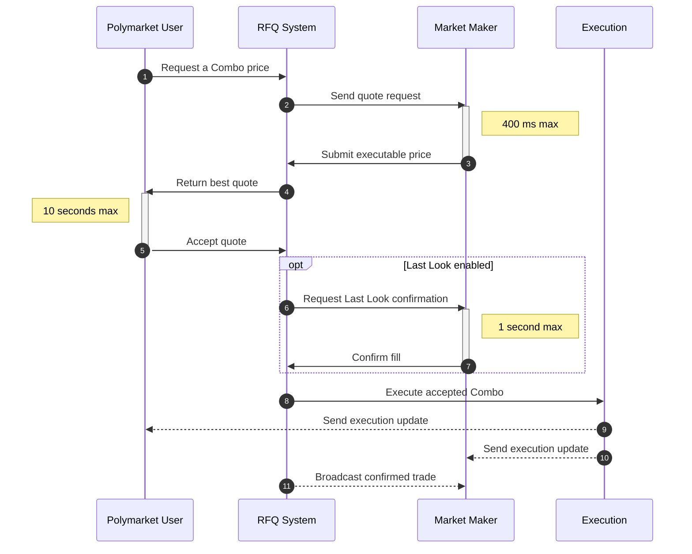

<!--
Source: https://docs.polymarket.com/trading/combos/overview.md
Downloaded: 2026-07-21T21:09:50.601Z
-->

> ## Documentation Index
> Fetch the complete documentation index at: https://docs.polymarket.com/llms.txt
> Use this file to discover all available pages before exploring further.

# How Combos Work

> Understand Combo positions and the RFQ flow for multi-leg markets

Combos are multi-leg positions that combine multiple underlying market outcomes
into one YES or NO position. Each Combo is defined by its legs and identified by
derived YES and NO position IDs.

The request for quote (RFQ) system enables quote-based Combo execution between
two participants: Polymarket users (requesters) and market makers (quoters). A
user creates a Request, which starts an auction among connected market makers.
Market makers compete by submitting Quotes: executable prices they are willing to
fill.

1. **User creates an unsigned Request** for a Combo price.
2. **RFQ system sends the Request** to connected market makers.
3. **Market makers submit signed Quotes** within the 400 ms submission window.
4. **RFQ system returns the best Quote** to the user.
5. **User accepts the Quote** by signing the trade within the 10-second
   acceptance window.
6. **RFQ system requests Last Look confirmation** when Last Look is enabled.
7. **Market maker confirms or declines** within the 1-second confirmation window.
8. **RFQ system executes the accepted Combo**.
9. **User receives execution updates**.
10. **Market maker receives execution updates**.
11. **Connected market makers receive confirmed trade broadcasts**.

<Note>
  Combo position IDs are complementary to CLOB token IDs. A user can trade the
  market on the CLOB or can include the market as a leg of a Combo.
</Note>

## Build With Combos

Integrate Combos into market maker systems or apps that request executable prices.

<CardGroup cols={2}>
  <Card title="Market Makers" icon="chart-line" href="/trading/combos/market-makers">
    Build a market maker integration for pricing and executing Combos.
  </Card>

  <Card title="Requesters" icon="arrows-rotate">
    <Badge color="gray" size="sm" shape="pill">Coming Soon</Badge>

    Request Combo quotes and execute accepted trades.
  </Card>
</CardGroup>
